# Hisob24 user app: to'liq ishlash strukturasi

Dizayner uchun. Holat: 2026-10-08, commit `488eaee`.

Bu hujjat Hisob24 user app'i va Telegram botlari qanday ishlashini tasvirlaydi. User app brauzerda `app.hisob24.uz` da va Telegram ichida Mini App bo'lib ochiladi. Hujjatda kim foydalanishi, qanday ekranlar borligi, ular qanday bog'langani, har ekranda nima turgani va hozir qanday ko'rinishi bor. Admin panel (platforma adminlari uchun) bu hujjatga kirmaydi.

**Skrinshotlar** [`screens/`](screens/) papkasida, jami 88 ta.

- Ular mock (sinov) ma'lumotlari bilan olingan: ismlar, raqamlar va summalar o'ylab topilgan.
- Telefon: 375×812 pt, @2x (fayl eni 750 px). Desktop: 1280×800 px, @1x.
- Uzun sahifalar to'liq bo'yi bilan olingan, shuning uchun ba'zi rasmlar baland.
- Hammasi light mavzuda; dark va Telegram mavzusi alohida ko'rsatilgan.
- Hamma ekranlar kompaniya egasi (Ali Valiyev, «Olma Savdo») ko'zi bilan, boshqasi bo'lsa izohda aytilgan. Kompaniyada ikki lokatsiya bor: «Asosiy» va «Chilonzor».

Interfeys matnlari koddagidek, aynan keltirilgan.

## Mundarija

1. [Mahsulot haqida](#1-mahsulot-haqida)
2. [Kim foydalanadi: rollar va ruxsatlar](#2-kim-foydalanadi-rollar-va-ruxsatlar)
3. [Qobiq va navigatsiya](#3-qobiq-va-navigatsiya)
4. [Sahifalar xaritasi](#4-sahifalar-xaritasi)
5. [Asosiy oqimlar](#5-asosiy-oqimlar)
6. [Umumiy naqshlar va holatlar](#6-umumiy-naqshlar-va-holatlar)
7. [Ekranlar](#7-ekranlar)
8. [Ma'lumotlar va maydonlar](#8-malumotlar-va-maydonlar)
9. [Telegram: Mini App va botlar](#9-telegram-mini-app-va-botlar)
10. [Dizayn tizimi (hozirgi holat)](#10-dizayn-tizimi-hozirgi-holat)
11. [Dizaynerga eslatmalar](#11-dizaynerga-eslatmalar)
12. [Ilova: interfeys matnlari](#12-ilova-interfeys-matnlari)

---

## 1. Mahsulot haqida

Hisob24 kompaniyalar uchun hisob tizimi (multi-tenant SaaS). Har kompaniya o'z ma'lumotini alohida yuritadi, boshqa kompaniyaning ma'lumotini ko'rmaydi.

| Bo'lim | Nima qiladi |
|---|---|
| Mijozlar | Mijozlar bazasi: telefon, turi (masalan Jismoniy, Yuridik) va shu turning maydonlari. |
| Vazifalar | Mijozga bog'langan ishlar: kanban (bosqichlar bo'yicha) yoki ro'yxat, muddat, mas'ul xodim. |
| Mahsulotlar | Mahsulotlar (birlik, narx, artikul, qoldiq) va xizmatlar. |
| Ombor | Ta'minotchidan xaridlar, lokatsiya bo'yicha qoldiq, ta'minotchiga to'lovlar va qarz. |
| Xodimlar | Kompaniya a'zolari, ularning roli va ishlaydigan lokatsiyalari. |
| Sozlamalar | Mijoz va vazifa turlari, ularning maydonlari, dropdownlar, bosqichlar, rollar. |

Tizim qismlari:

| Qism | Kim uchun | Qayerda | Bu hujjatda |
|---|---|---|---|
| User app | kompaniya egasi va xodimlari | brauzer: `app.hisob24.uz`; Telegram: user botdagi Mini App | to'liq |
| User bot (`@hisob24bot`) | kompaniya a'zolari | Telegram | [9-bo'lim](#9-telegram-mini-app-va-botlar) |
| Admin bot | platforma adminlari | Telegram | 9-bo'limda qisqacha |
| Admin panel | platforma adminlari | `admin.hisob24.uz` | kirmaydi |

User app'ga admin paneldan keladigan narsalar. User app'da ular boshqarilmaydi, faqat natijasi ko'rinadi:

- **Kompaniya va uning egasi.** Kompaniyani admin yaratadi va egasini qo'yadi. Egasini faqat admin almashtiradi.
- **Obuna.** Muddati tugasa yoki kompaniya bloklansa, a'zolar «Obuna muddati tugagan» ekraniga tushadi.
- **Lokatsiyalar (filiallar).** Ularni admin qo'shadi, nomini o'zgartiradi va o'chiradi; egasi user app'dan qo'sha olmaydi. Har kompaniya «Asosiy» lokatsiya bilan boshlanadi.

Umumiy shartlar:

- interfeys tili o'zbek (lotin);
- pul faqat so'mda;
- telefon faqat O'zbekiston raqami (+998);
- mobile-first: asosiy foydalanish telefonda va Telegram ichida;
- light, dark va Telegram mavzusi.

## 2. Kim foydalanadi: rollar va ruxsatlar

### 2.1. Kimlar

| Kim | Interfeysda | Qanday paydo bo'ladi | Kompaniyada nechta |
|---|---|---|---|
| Egasi (`owner`) | «Egasi» | platforma admini kompaniya yaratganda qo'yadi | aynan bitta |
| Xodim (`user`) | «Xodim» yoki rol nomi | egasi (yoki shunga ruxsatli xodim) Xodimlar bo'limida qo'shadi | cheklanmagan |
| Mijoz | — | Mijozlar bo'limida yoziladi | tizimga kirmaydi, user emas |

- **Kompaniya roli.** Egasi Sozlamalar → Rollar'da nom va ruxsatlar to'plamini tuzadi (masalan «Sotuvchi») va xodimga biriktiradi. Rolli xodim faqat rol ruxsatlari bilan ishlaydi. Rolsiz xodim standart to'plam bilan ishlaydi.
- **Bir nechta kompaniya.** Bitta telefon raqami bir nechta kompaniyada bo'lishi mumkin, har birida o'z roli va ismi bilan. Bir vaqtda bitta kompaniyada ishlanadi; almashtirish profil menyusidagi «Kompaniyani almashtirish» orqali.
- **Lokatsiya cheklovi.** Egasi xodimni ba'zi lokatsiyalar bilan cheklashi mumkin; standart holatda xodim hamma lokatsiyada ishlaydi. Egasining o'zi har doim hamma lokatsiyada.
- **Kirish.** Tizimga kamida bitta kompaniyaga a'zo odam kira oladi. O'zi ro'yxatdan o'tish yoki taklif oqimi yo'q.

### 2.2. Ruxsat katalogi

Ruxsat «bo'lim + amal» ko'rinishida beriladi. Rol formasida u shu jadval shaklidagi checkbox matritsasi bo'lib ko'rinadi ([7.25](#725-rol-sahifasi)).

| Bo'lim | Ko'rish | Qo'shish | Tahrirlash | O'chirish | Tarix |
|---|---|---|---|---|---|
| Mijozlar | ro'yxat, mijoz sahifasi, telefon takliflari | mijoz qo'shish | tahrirlash | o'chirish | o'zgarishlar tarixi |
| Vazifalar | ro'yxat, kanban, vazifa sahifasi | vazifa qo'shish | tahrirlash, bosqichni o'zgartirish (sudrash ham) | o'chirish | o'zgarishlar tarixi |
| Mahsulotlar | mahsulotlar va xizmatlar, mahsulot sahifasi | qo'shish | tahrirlash, nofaol qilish | o'chirish | — |
| Ta'minotchilar | ro'yxat, ta'minotchi sahifasi | qo'shish | tahrirlash, nofaol qilish | o'chirish | — |
| Xaridlar | xaridlar, xarid sahifasi, ta'minotchi balansi va to'lovlari | xarid va to'lov qo'shish | xarid va to'lovni tahrirlash | xarid va to'lovni o'chirish | — |
| Xodimlar | xodimlar ro'yxati | xodim qo'shish | ismini o'zgartirish | o'chirish | — |
| Sozlamalar | Sozlamalar sahifasi | tur, maydon, dropdown, variant, bosqich qo'shish | nom, belgilar, tartib, variantni nofaol qilish | o'chirish | — |

Qoida: biror amal belgilansa, shu bo'limning «Ko'rish»i ham belgilanadi. «Ko'rish» olib tashlansa, bo'limning hamma amali tozalanadi.

### 2.3. Kim nimaga ega

| Amal | Egasi | Rolsiz xodim | Rolli xodim |
|---|---|---|---|
| Kirish, Bosh sahifa, kompaniyani almashtirish, menyu tartibi | ✓ | ✓ | ✓ |
| Mijozlar: ko'rish, qo'shish, tahrirlash, o'chirish | ✓ | ✓ | rol bo'yicha |
| Mijoz tarixini ko'rish | ✓ | ✗ | rol bo'yicha |
| Vazifalar: ko'rish, qo'shish, tahrirlash, ko'chirish, o'chirish | ✓ | ✓ | rol bo'yicha |
| Vazifa tarixini ko'rish | ✓ | ✗ | rol bo'yicha |
| Mahsulotlar, Ta'minotchilar, Xaridlar (hamma amal) | ✓ | ✓ | rol bo'yicha |
| Xodimlar | ✓ | ✗ | rol bo'yicha |
| Sozlamalar (turlar, maydonlar, dropdownlar, bosqichlar) | ✓ | ✗ | rol bo'yicha |
| Rollar: yaratish, o'zgartirish, xodimga biriktirish | ✓ | ✗ | ✗ |
| Xodimni lokatsiya bilan cheklash | ✓ | ✗ | ✗ |

### 2.4. Ruxsat interfeysga qanday ta'sir qiladi

- **Menyu.** Bo'lim menyuda faqat uning «Ko'rish» ruxsati bo'lsa chiqadi; Bosh sahifa hammaga. «Ombor» Xaridlar yoki Ta'minotchilar ko'rish ruxsati bilan chiqadi va ruxsatli birinchi tabiga ochiladi.
- **Tugmalar.** Ruxsat bo'lmagan amalning tugmasi umuman chizilmaydi (o'chiq holatda turmaydi, yo'q bo'ladi).
- **Qo'lda ochilgan manzil.** Ruxsatsiz bo'limga havola bilan kirilsa, bosh sahifaga qaytariladi.
- **Sessiya ichidagi o'zgarish.** Rol sessiya ochiq paytda o'zgarsa, keyingi rad etilgan so'rovdan keyin menyu yangilanadi.
- **Ikki bo'limga tegadigan joylar:**
  - «Vazifa qo'shish» uchun Vazifalar «Qo'shish» va Mijozlar «Ko'rish» kerak. Formadagi «yangi mijoz» qismi Mijozlar «Qo'shish» bilan chiqadi.
  - «Xarid qo'shish» uchun Xaridlar «Qo'shish», Ta'minotchilar «Ko'rish» va Mahsulotlar «Ko'rish» kerak.
  - Mijoz sahifasidagi «Vazifalar» bo'limi Vazifalar «Ko'rish» bilan chiqadi.
  - Ta'minotchi sahifasidagi balans, xaridlar va to'lovlar, mahsulot sahifasidagi xaridlar Xaridlar «Ko'rish» bilan chiqadi.
- **Faqat egasiga:** Sozlamalardagi «Rollar» tabi, xodim qatoridagi rol va lokatsiya tugmalari.

Rolli xodim: «Sotuvchi» roli bilan faqat Bosh sahifa, Mijozlar va Vazifalar ko'rinadi.

<table>
<tr><th>Telefon</th><th>Desktop</th></tr>
<tr>
<td valign="top">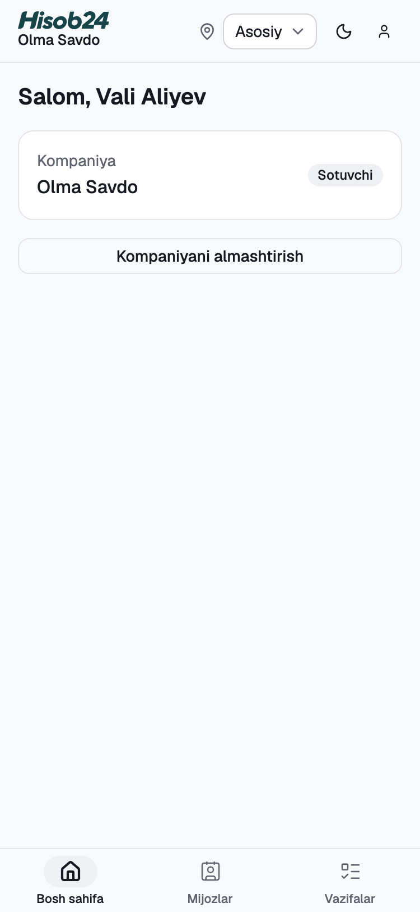</td>
<td valign="top">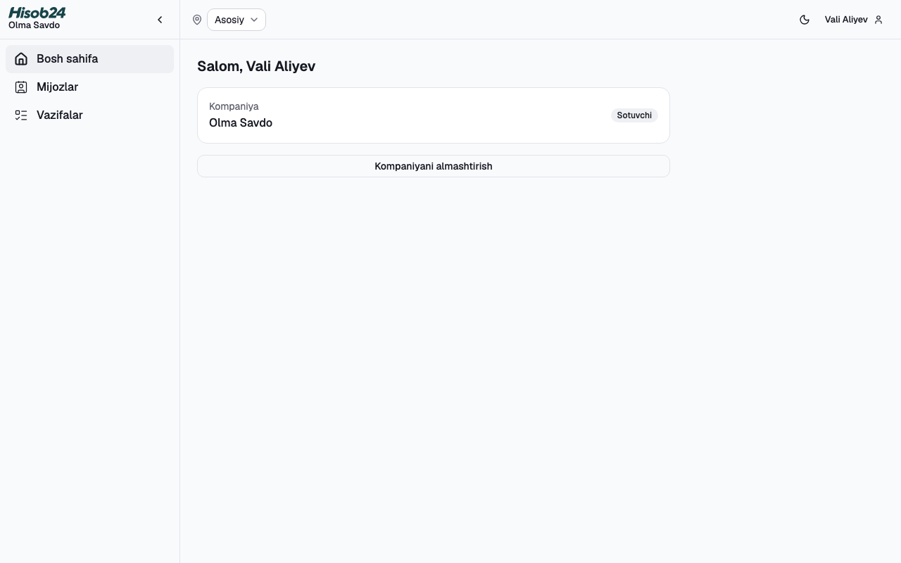</td>
</tr>
</table>

## 3. Qobiq va navigatsiya

Kirgandan keyingi hamma sahifa bitta qobiq ichida turadi: navigatsiya (sidebar yoki tab-bar), tepada topbar va o'rtada sahifa mazmuni. Mazmun kontent maydonining to'liq enini oladi, o'rtaga siqilmaydi.

### 3.1. Ekran kengligi bo'yicha

| Kenglik | Navigatsiya | Ro'yxatlar |
|---|---|---|
| 768 px dan tor (telefon, Mini App) | tepada topbar, pastda tab-bar | kartochkalar |
| 768 px va kengroq | chapda sidebar (yig'iladi), tepada topbar | jadval |

Telefonda chapdan chiqadigan menyu yo'q: bo'limlar faqat pastki tab-bar'da.

### 3.2. Topbar

Balandligi 56 px, pastida chiziq.

| Joy | Telefonda | Keng ekranda |
|---|---|---|
| Chapda | logotip, ostida kompaniya nomi | lokatsiya tanlovchisi |
| Nom va profil orasida | lokatsiya tanlovchisi (o'ngga yaqin) | — |
| O'ngda | mavzu tugmasi (oy / quyosh), profil tugmasi | mavzu tugmasi, ism va profil tugmasi |

- **Lokatsiya tanlovchisi** faqat a'zoga 2 va undan ko'p lokatsiya ruxsat etilganda chiqadi. Tanlov vazifalar, xaridlar va mahsulotlardagi «Qoldiq» ustuniga ta'sir qiladi.
- **Mavzu tugmasi** Telegram ichida yo'q: u yerda rangni chat beradi.
- **Profil menyusi** tarkibi:
  - ism va telefon;
  - «Menyuni sozlash»;
  - «Kompaniyani almashtirish» (2+ faol kompaniya bo'lsa);
  - qizil «Chiqish» (Telegram ichida yo'q).

<table>
<tr><th>Telefon: profil menyusi</th><th>Telefon: lokatsiya tanlovchisi</th></tr>
<tr>
<td valign="top">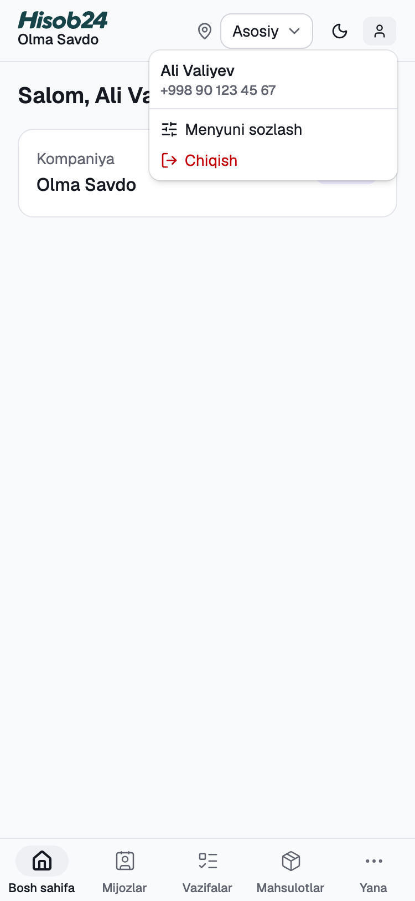</td>
<td valign="top">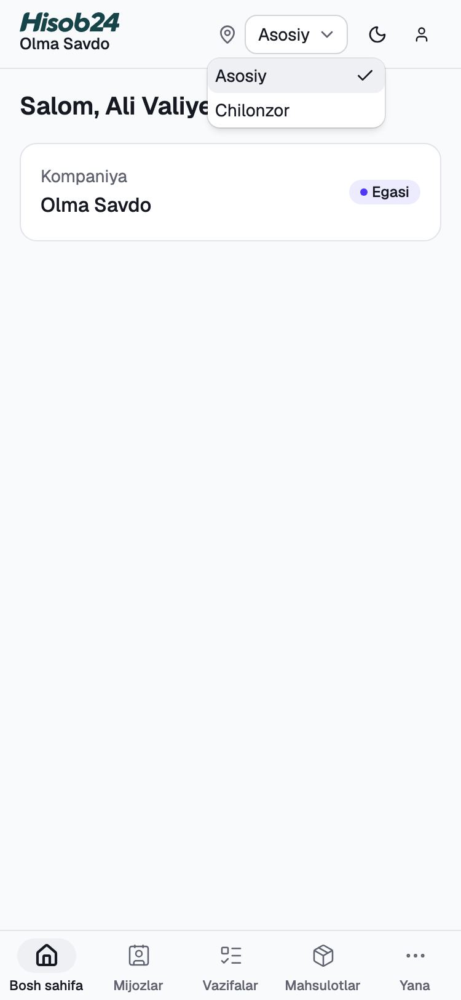</td>
</tr>
</table>

<table>
<tr><th>Desktop: profil menyusi</th><th>Desktop: lokatsiya tanlovchisi</th></tr>
<tr>
<td valign="top">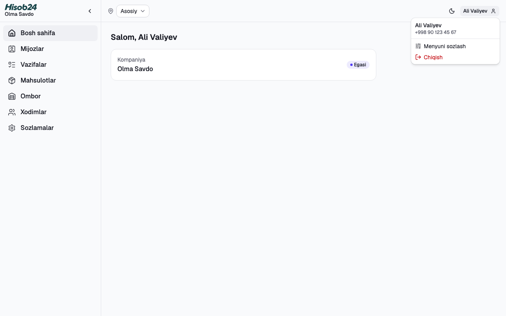</td>
<td valign="top">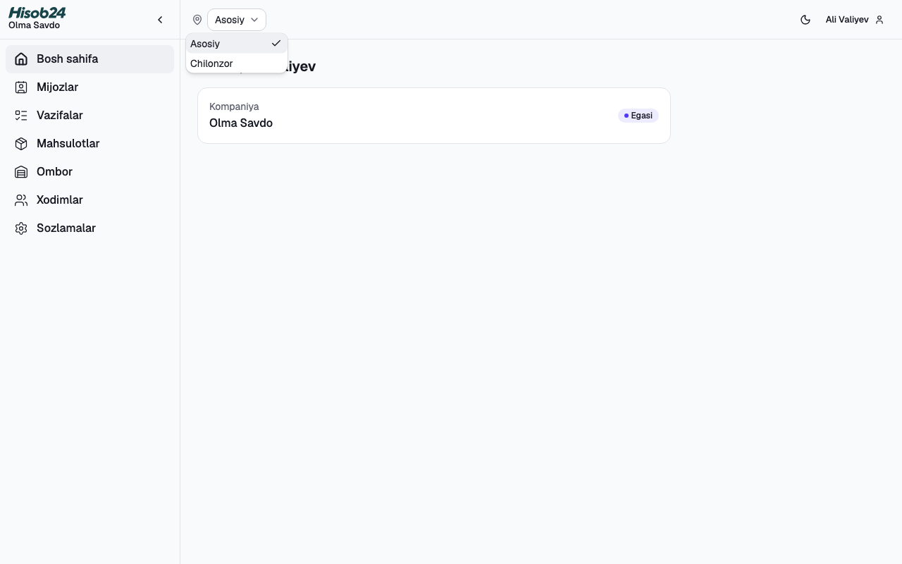</td>
</tr>
</table>

### 3.3. Sidebar (768 px dan keng)

- Eni 256 px; yig'ilganda 64 px (faqat ikonkalar, ustiga borilsa nomi tooltip'da). Tanlov brauzerda eslanadi.
- Tepada logotip va ostida kompaniya nomi; yig'ilganda «H24» belgisi. Yonida «Menyuni yig'ish» / «Menyuni yoyish» tugmasi.
- Bo'limlar ikonka va nom bilan. Joriy bo'lim yumshoq fonli plashkada, ikonkasi qalinroq.

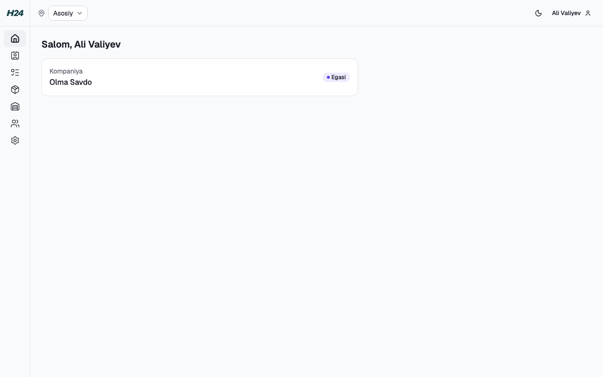

### 3.4. Tab-bar (768 px dan tor)

- Pastda, balandligi 56 px va telefonning pastki xavfsiz zonasi. Har tugmada ikonka (20 px) va nom (11 px).
- Joriy bo'lim: ikonka ostida yumshoq plashka va qalinroq ikonka. Qolganlari xira.
- Bo'limlar soni 5 tagacha bo'lsa hammasi turadi. 6 va undan ko'p bo'lsa, birinchi 4 tasi va **«Yana»** turadi.
- «Yana» pastdan chiqadigan varaq ochadi: unda qolgan bo'limlar va pastida «Menyuni sozlash». Joriy sahifa shu bo'limlardan birida bo'lsa, «Yana» joriy bo'lib belgilanadi.

Kimda nechta tugma: egasida 7 bo'lim, demak 4 ta va «Yana» (Ombor, Xodimlar, Sozlamalar). Rolsiz xodimda 5 bo'lim, «Yana» yo'q. Rolli xodimda rolga qarab 1–7.

### 3.5. Menyu tartibi

Standart tartib: Bosh sahifa, Mijozlar, Vazifalar, Mahsulotlar, Ombor, Xodimlar, Sozlamalar. Har a'zo uni o'zi o'zgartiradi:

- «Menyuni sozlash» dialogi «Yana» varag'i pastida va profil menyusida ochiladi.
- Bo'limlar sudrab tartiblanadi. Tugmalar: «Saqlash» va «Standart holat».
- Tartib serverda saqlanadi: shu kompaniyada har qurilmada bir xil.
- Sidebar va tab-bar bir xil tartibda: telefonda birinchi to'rttasi panelda, qolgani «Yana»da.

<table>
<tr><th>Bosh sahifa</th><th>«Yana»</th><th>«Menyuni sozlash»</th></tr>
<tr>
<td valign="top">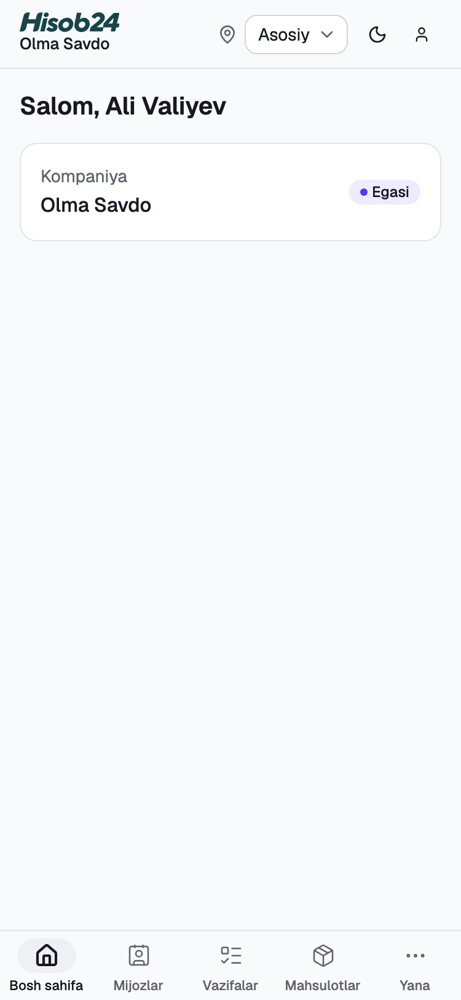</td>
<td valign="top">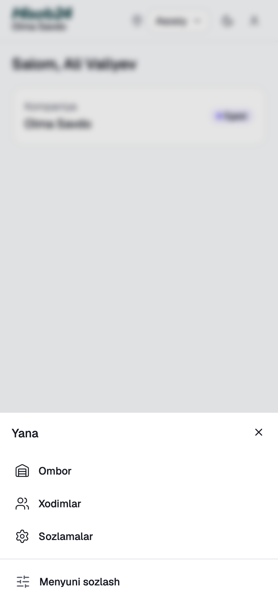</td>
<td valign="top">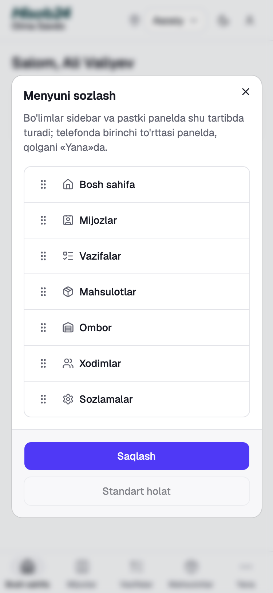</td>
</tr>
</table>

### 3.6. Bo'lim tablari

Ikki bo'limda ichki sahifalar bor. Ular sahifa tepasidagi tab tasmasi bilan almashadi:

- **Mahsulotlar:** Mahsulotlar (`/products`) va Xizmatlar (`/services`);
- **Ombor:** Xaridlar (`/purchases`) va Ta'minotchilar (`/suppliers`).

Tasmada faqat a'zo ko'ra oladigan tablar turadi.

### 3.7. Qobiqsiz ekranlar

`/login`, `/select-company` va `/expired` to'liq ekran, sidebar va tab-bar'siz.

## 4. Sahifalar xaritasi

Qobiq ichidagi sahifalar menyu tartibida. Kirish ekranlari (`/login`, `/select-company`, `/expired`) qobiqdan tashqarida; ular orasidagi yo'l [5.1](#51-brauzerda-kirish-sms-kod) diagrammasida.

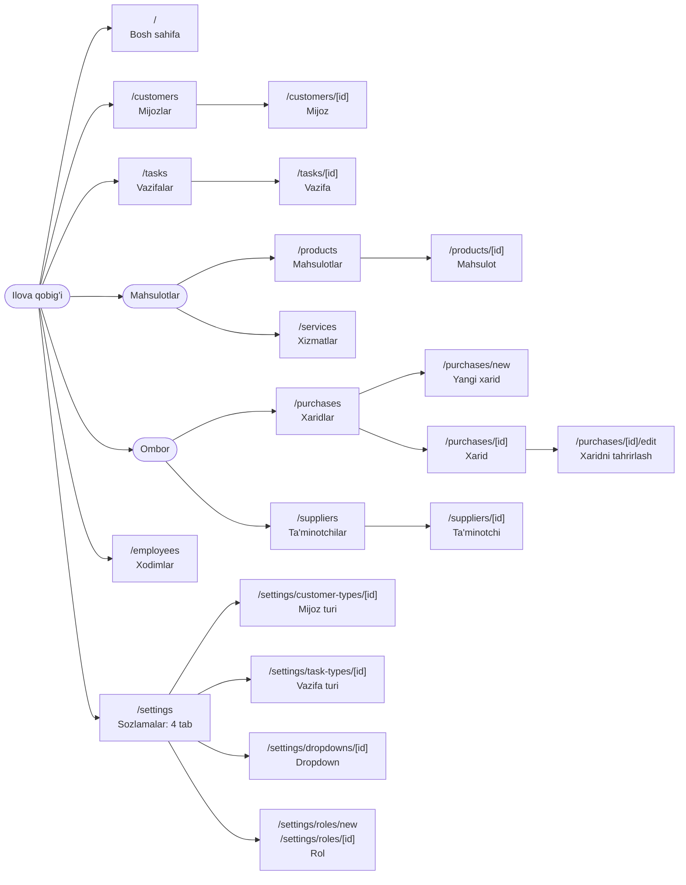
```mermaid
flowchart LR
  shell(["Ilova qobig'i"]) --> home["/<br/>Bosh sahifa"]
  shell --> customers["/customers<br/>Mijozlar"] --> customer["/customers/[id]<br/>Mijoz"]
  shell --> tasks["/tasks<br/>Vazifalar"] --> task["/tasks/[id]<br/>Vazifa"]
  shell --> catalog(["Mahsulotlar"])
  catalog --> products["/products<br/>Mahsulotlar"] --> product["/products/[id]<br/>Mahsulot"]
  catalog --> services["/services<br/>Xizmatlar"]
  shell --> warehouse(["Ombor"])
  warehouse --> purchases["/purchases<br/>Xaridlar"]
  purchases --> pnew["/purchases/new<br/>Yangi xarid"]
  purchases --> purchase["/purchases/[id]<br/>Xarid"]
  purchase --> pedit["/purchases/[id]/edit<br/>Xaridni tahrirlash"]
  warehouse --> suppliers["/suppliers<br/>Ta'minotchilar"] --> supplier["/suppliers/[id]<br/>Ta'minotchi"]
  shell --> employees["/employees<br/>Xodimlar"]
  shell --> settings["/settings<br/>Sozlamalar: 4 tab"]
  settings --> ctype["/settings/customer-types/[id]<br/>Mijoz turi"]
  settings --> ttype["/settings/task-types/[id]<br/>Vazifa turi"]
  settings --> ddown["/settings/dropdowns/[id]<br/>Dropdown"]
  settings --> role["/settings/roles/new<br/>/settings/roles/[id]<br/>Rol"]
```

| Manzil | Ekran | Kim ko'radi | Turi |
|---|---|---|---|
| `/login` | Kirish: telefon, keyin SMS kod; Telegram ichida avtomatik kirish | hamma | qobiqsiz |
| `/select-company` | Kompaniyani tanlash | 2+ kompaniyali a'zo | qobiqsiz |
| `/expired` | Obuna muddati tugagan | obunasi tugagan yoki bloklangan kompaniya a'zosi | qobiqsiz |
| `/` | Bosh sahifa | hamma a'zo | sahifa |
| `/customers` | Mijozlar | Mijozlar «Ko'rish» | ro'yxat |
| `/customers/[id]` | Mijoz | Mijozlar «Ko'rish» | yozuv sahifasi |
| `/tasks` | Vazifalar: kanban yoki ro'yxat (`?view=list`) | Vazifalar «Ko'rish» | ro'yxat |
| `/tasks/[id]` | Vazifa | Vazifalar «Ko'rish» | yozuv sahifasi |
| `/products` | Mahsulotlar | Mahsulotlar «Ko'rish» | ro'yxat (tab) |
| `/products/[id]` | Mahsulot | Mahsulotlar «Ko'rish» | yozuv sahifasi |
| `/services` | Xizmatlar | Mahsulotlar «Ko'rish» | ro'yxat (tab) |
| `/purchases` | Xaridlar | Xaridlar «Ko'rish» | ro'yxat (tab) |
| `/purchases/new` | Yangi xarid | Xaridlar «Qo'shish», Ta'minotchilar va Mahsulotlar «Ko'rish» | forma sahifasi |
| `/purchases/[id]` | Xarid | Xaridlar «Ko'rish» | yozuv sahifasi |
| `/purchases/[id]/edit` | Xaridni tahrirlash | Xaridlar «Tahrirlash», Ta'minotchilar va Mahsulotlar «Ko'rish» | forma sahifasi |
| `/suppliers` | Ta'minotchilar | Ta'minotchilar «Ko'rish» | ro'yxat (tab) |
| `/suppliers/[id]` | Ta'minotchi | Ta'minotchilar «Ko'rish»; balans va to'lovlar Xaridlar «Ko'rish» bilan | yozuv sahifasi |
| `/employees` | Xodimlar | Xodimlar «Ko'rish» | ro'yxat |
| `/settings` | Sozlamalar: Mijozlar, Vazifalar, Dropdownlar, Rollar tablari (`?tab=`) | Sozlamalar «Ko'rish»; «Rollar» faqat egasi | tablar |
| `/settings/customer-types/[id]` | Mijoz turi va uning maydonlari | Sozlamalar «Ko'rish» | yozuv sahifasi |
| `/settings/task-types/[id]` | Vazifa turi va uning maydonlari | Sozlamalar «Ko'rish» | yozuv sahifasi |
| `/settings/dropdowns/[id]` | Dropdown va uning variantlari | Sozlamalar «Ko'rish» | yozuv sahifasi |
| `/settings/roles/new`, `/settings/roles/[id]` | Rol: nom va ruxsat matritsasi | faqat egasi | forma sahifasi |

Filtrlar, tab va sahifa raqami manzilda turadi (masalan `/customers?type=3&search=ali&page=2`). Havola ulashilsa, ro'yxat o'sha holatda ochiladi.

**Dialoglar** (alohida sahifa emas):

- Mijoz: qo'shish, tahrirlash.
- Vazifa: qo'shish, tahrirlash.
- Mahsulot: qo'shish, tahrirlash. Xizmat: qo'shish, tahrirlash.
- Ta'minotchi: qo'shish, tahrirlash. To'lov: qo'shish, tahrirlash.
- Xodim: qo'shish, ismni o'zgartirish, rolni o'zgartirish, lokatsiyalarni o'zgartirish.
- Sozlamalar: tur, vazifa turi, dropdown qo'shish va nomini o'zgartirish; maydon qo'shish va tahrirlash; bosqich qo'shish va tahrirlash.
- Qobiq: «Menyuni sozlash», «Yana» varag'i.
- O'chirish tasdiqlari («…ni o'chirasizmi?»).

Xarid formasi dialog emas, alohida sahifa: u ko'p qatorli.

## 5. Asosiy oqimlar

### 5.1. Brauzerda kirish (SMS kod)

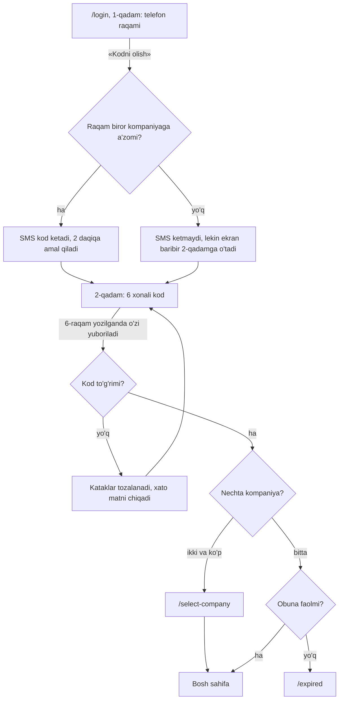
```mermaid
flowchart TD
  A["/login, 1-qadam: telefon raqami"] -->|"«Kodni olish»"| B{"Raqam biror kompaniyaga a'zomi?"}
  B -->|ha| C["SMS kod ketadi, 2 daqiqa amal qiladi"]
  B -->|yo'q| D["SMS ketmaydi, lekin ekran baribir 2-qadamga o'tadi"]
  C --> E["2-qadam: 6 xonali kod"]
  D --> E
  E -->|"6-raqam yozilganda o'zi yuboriladi"| F{"Kod to'g'rimi?"}
  F -->|yo'q| G["Kataklar tozalanadi, xato matni chiqadi"] --> E
  F -->|ha| H{"Nechta kompaniya?"}
  H -->|bitta| I{"Obuna faolmi?"}
  H -->|ikki va ko'p| J["/select-company"] --> K["Bosh sahifa"]
  I -->|ha| K
  I -->|yo'q| L["/expired"]
```

- Bir raqamga daqiqasiga bitta SMS ketadi. «Kodni qayta yuborish (60)» tugmasi 60 soniyalik teskari sanoq tugaguncha bosilmaydi. Bir daqiqa ichida boshqa yo'l bilan qayta so'ralsa: «Kodni qayta olish uchun bir daqiqa kuting».
- «Raqamni o'zgartirish» 1-qadamga qaytaradi. Qadamlar orasida 200 ms siljish bor: oldinga o'ngdan, orqaga chapdan.
- Kirish 30 kun saqlanadi. Sessiya tugasa, `/login` ga qaytaradi: «Sessiya tugagan. Qayta kiring».

### 5.2. Telegram orqali kirish (Mini App)

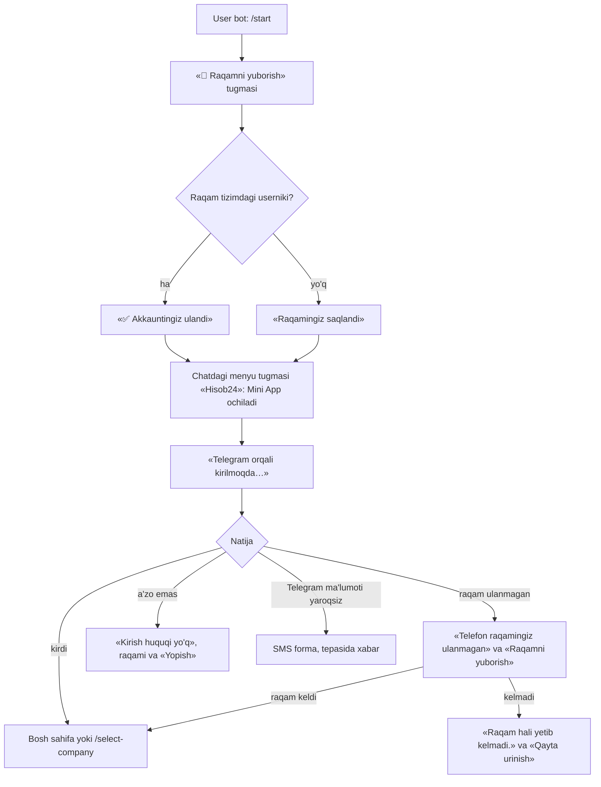
```mermaid
flowchart TD
  A["User bot: /start"] --> B["«📱 Raqamni yuborish» tugmasi"]
  B --> C{"Raqam tizimdagi userniki?"}
  C -->|ha| D["«✅ Akkauntingiz ulandi»"]
  C -->|yo'q| E["«Raqamingiz saqlandi»"]
  D --> F["Chatdagi menyu tugmasi «Hisob24»: Mini App ochiladi"]
  E --> F
  F --> G["«Telegram orqali kirilmoqda…»"]
  G --> H{"Natija"}
  H -->|kirdi| I["Bosh sahifa yoki /select-company"]
  H -->|raqam ulanmagan| J["«Telefon raqamingiz ulanmagan» va «Raqamni yuborish»"]
  H -->|a'zo emas| K["«Kirish huquqi yo'q», raqami va «Yopish»"]
  H -->|Telegram ma'lumoti yaroqsiz| L["SMS forma, tepasida xabar"]
  J -->|raqam keldi| I
  J -->|kelmadi| M["«Raqam hali yetib kelmadi.» va «Qayta urinish»"]
```

Mini App'da login formasi ko'rinmaydi: kirish avtomatik. Telegram'da «Chiqish» yo'q, Mini App'ni yopish chiqish hisoblanadi.

### 5.3. Kompaniya va obuna

- Bitta kompaniyali a'zo darhol bosh sahifaga tushadi. Ikki va undan ko'p bo'lsa, `/select-company` da tanlaydi.
- Ro'yxatda muddati o'tgan («Muddati o'tgan», qizil belgi) va bloklangan («Bloklangan», neytral belgi) kompaniyalar xira turadi va tanlanmaydi.
- Ish paytida obuna tugasa, keyingi so'rovda `/expired` ochiladi. Unda «Boshqa kompaniyani tanlash» (kompaniyalar ro'yxatiga olib boradi) va «Chiqish» (Telegram ichida yo'q) bor.

### 5.4. Mijoz qo'shish

1. Mijozlar → «Mijoz qo'shish».
2. Dialogda tur tanlanadi (Jismoniy / Yuridik va h.k.): forma shu turning maydonlariga almashadi.
3. Telefon (+998) va maydonlar to'ldiriladi. Ixtiyoriy maydon yonida xira «ixtiyoriy» turadi.
4. «Qo'shish» bosiladi. Xato bo'lsa, maydon ostida matn chiqadi. Takror telefon yoki takrorlanmas qiymat bo'lsa, dialog ichida rad javobi va «Mijozni ochish» havolasi chiqadi.
5. Saqlangach dialog yopiladi, toast «Mijoz qo'shildi», yangi mijoz ro'yxat boshida.

### 5.5. Vazifa qo'shish va kanban'da ko'chirish

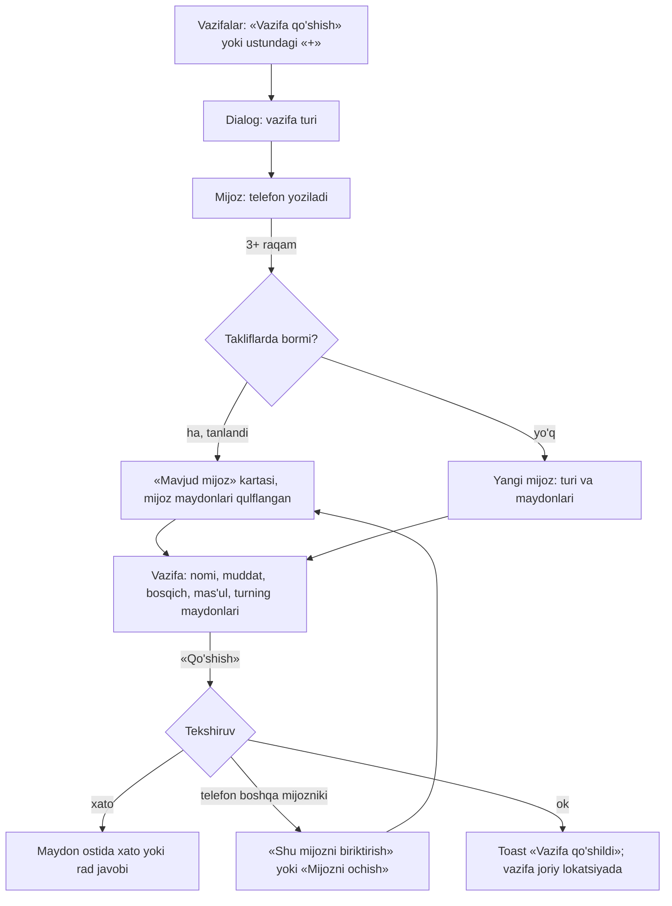
```mermaid
flowchart TD
  A["Vazifalar: «Vazifa qo'shish» yoki ustundagi «+»"] --> B["Dialog: vazifa turi"]
  B --> C["Mijoz: telefon yoziladi"]
  C -->|"3+ raqam"| D{"Takliflarda bormi?"}
  D -->|"ha, tanlandi"| E["«Mavjud mijoz» kartasi, mijoz maydonlari qulflangan"]
  D -->|yo'q| F["Yangi mijoz: turi va maydonlari"]
  E --> G["Vazifa: nomi, muddat, bosqich, mas'ul, turning maydonlari"]
  F --> G
  G -->|"«Qo'shish»"| H{"Tekshiruv"}
  H -->|xato| I["Maydon ostida xato yoki rad javobi"]
  H -->|"telefon boshqa mijozniki"| J["«Shu mijozni biriktirish» yoki «Mijozni ochish»"]
  J --> E
  H -->|ok| K["Toast «Vazifa qo'shildi»; vazifa joriy lokatsiyada"]
```

- Lokatsiya formada so'ralmaydi: vazifa topbar'dagi joriy lokatsiyaga tushadi va keyin o'zgarmaydi.
- «Mas'ul» ro'yxatida faqat shu lokatsiyada ishlaydigan a'zolar bor.
- Kanban'da karta boshqa ustunga sudrab tashlanadi (sichqoncha yoki barmoq) yoki kartadagi «⋮» bosqich menyusidan ko'chiriladi. Rad etilsa, karta joyiga qaytadi va sababi toast'da chiqadi.

### 5.6. Xarid (omborga kirim)

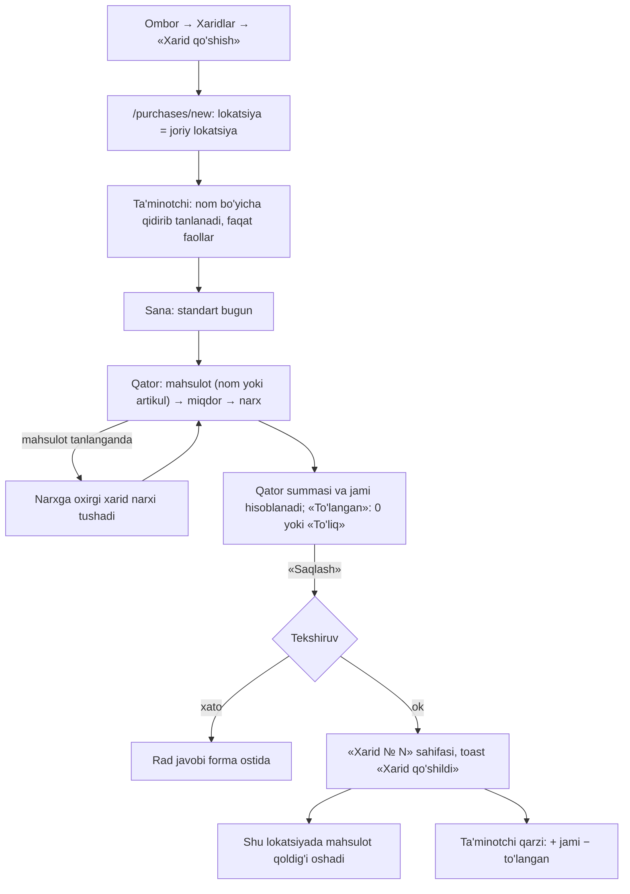
```mermaid
flowchart TD
  A["Ombor → Xaridlar → «Xarid qo'shish»"] --> B["/purchases/new: lokatsiya = joriy lokatsiya"]
  B --> C["Ta'minotchi: nom bo'yicha qidirib tanlanadi, faqat faollar"]
  C --> D["Sana: standart bugun"]
  D --> E["Qator: mahsulot (nom yoki artikul) → miqdor → narx"]
  E -->|"mahsulot tanlanganda"| F["Narxga oxirgi xarid narxi tushadi"]
  F --> E
  E --> G["Qator summasi va jami hisoblanadi; «To'langan»: 0 yoki «To'liq»"]
  G -->|"«Saqlash»"| H{"Tekshiruv"}
  H -->|xato| I["Rad javobi forma ostida"]
  H -->|ok| J["«Xarid № N» sahifasi, toast «Xarid qo'shildi»"]
  J --> K["Shu lokatsiyada mahsulot qoldig'i oshadi"]
  J --> L["Ta'minotchi qarzi: + jami − to'langan"]
```

Xaridning statusi yo'q: saqlangan zahoti qoldiqqa tushadi. Tahrirlansa, qoldiq farq bo'yicha qayta hisoblanadi. O'chirilsa, qoldiq qaytadi, raqam esa bo'shamaydi.

### 5.7. Ta'minotchiga to'lov

1. Ta'minotchi sahifasi → «To'lov qo'shish».
2. Summa, sana (standart bugun), ixtiyoriy izoh → «Qo'shish».
3. Balans kamayadi. To'lov qarzdan oshsa, balans «Avans» bo'ladi.

Xarid formasidagi «To'langan» summasi ham to'lov bo'lib yoziladi. U ta'minotchi sahifasida «Xarid № N» havolasi bilan turadi va faqat xarid orqali o'zgaradi.

### 5.8. Rol yaratish va biriktirish (egasi)

1. Sozlamalar → «Rollar» tabi → «Rol qo'shish».
2. Rol nomi va ruxsat matritsasi → «Saqlash». Toast «Rol yaratildi».
3. Xodimlar → xodim qatoridagi qalqon ikonkasi → «Rolni o'zgartirish» dialogi → rol (yoki «Rolsiz») → «Saqlash».
4. Xodimning keyingi so'rovidan yangi ruxsatlar amal qiladi: menyu va tugmalar o'zgaradi.

### 5.9. Xodimni lokatsiya bilan cheklash (egasi)

1. Xodimlar → xodim qatoridagi pin ikonkasi → «Lokatsiyalarni o'zgartirish».
2. «Barcha lokatsiyalar» belgisi yoki aniq lokatsiyalar. Kamida bittasi tanlanishi shart.
3. Xodim boshqa lokatsiyalarda vazifalarga mas'ul bo'lsa, dialog ogohlantiradi: «Boshqa lokatsiyalarda N ta vazifaga mas'ul». Saqlash baribir mumkin.
4. Toast «Lokatsiyalar o'zgartirildi». Xodim endi faqat shu lokatsiyalarning vazifa va xaridlarini ko'radi.

### 5.10. Menyu tartibini sozlash

1. Telefonda «Yana» → «Menyuni sozlash», yoki profil menyusi → «Menyuni sozlash».
2. Bo'limlar sudrab tartiblanadi → «Saqlash». Toast «Menyu tartibi saqlandi».
3. «Standart holat» tartibni boshlang'ichiga qaytaradi.

## 6. Umumiy naqshlar va holatlar

### 6.1. Ro'yxat sahifasi

Tepadan pastga:

1. **Sarlavha qatori.** `h1` (masalan «Mijozlar»), ostida xira izoh soni bilan («Kompaniyangiz mijozlari · 10 ta»), o'ngda bitta asosiy tugma («Mijoz qo'shish»). Telefonda tugma sarlavha yonida, 352 px dan tor ekranda sarlavha ostida.
2. **Asboblar qatori.** Tur yoki holat tablari («Barchasi», «Jismoniy», «Yuridik»; «Faol», «Nofaol»), qidiruv, filtrlar, «Ustunlar» menyusi.
3. **Ro'yxat ramkasi.** 768 px dan jadval: sarlavha tasmasi, qatorlar orasida ingichka chiziq. Telefonda shu ma'lumot kartochkalarda.
4. **Footer.** Bitta sahifada «Jami: N». Ko'p sahifada «N tadan M ta ko'rsatilmoqda» va raqamli pager: `‹ 1 … 4 5 6 … 20 ›`. Sahifada 20 ta yozuv.

Kartochka tuzilishi: tepada nom (va ikkinchi qator); o'ngda asosiy raqam (masalan summa); ostida belgilar va «Qo'shilgan dd.mm.yyyy»; keyin «nom — qiymat» qatorlari. Bo'sh qiymat kartada joy olmaydi, jadvalda xira «—» bo'ladi. Havolali kartaning istalgan joyi bosiladi.

Har a'zo «Ustunlar» menyusida jadval ustunlarini o'ziga yashiradi (Mijozlar va Vazifalar ro'yxatida). Tanlov brauzerda saqlanadi, birinchi ustun yashirilmaydi.

### 6.2. Yozuv sahifasi

Tepadan pastga:

1. Orqaga havola (masalan «← Mijozlar»).
2. Sarlavha: kerak joyda avatar bilan; ostida xira izoh («Jismoniy · +998 91 111 22 33»).
3. Amallar: asosiy «Tahrirlash» (to'liq rangli), «O'chirish» va boshqalari konturli. Telefonda ular sarlavha ostida.
4. «Ma'lumot» bo'limi: bitta ramkada «nom — qiymat» qatorlari. Bo'sh qiymat «—».
5. Bog'liq ro'yxatlar: mijozning vazifalari, mahsulotning xaridlari va h.k.
6. «Tarix» (Mijoz va Vazifada, ruxsat bo'lsa): kim, qachon, nima o'zgardi (eski → yangi).

### 6.3. Formalar

- Kichik formalar dialogda. Dialog sarlavhasi 16 px, ostida izoh («Nom majburiy; narx va izoh ixtiyoriy.»), pastda tasma va tugma. Telefonda tugma to'liq enda, dialog ekran bo'yidan oshmaydi (ichida scroll).
- Katta forma (xarid) alohida sahifada.
- Maydon xatosi maydon ostida. Server rad javobi forma ichida ikonka bilan, maydon xatosidan ajralib turadi.
- Yuborilayotgan tugmada spinner. Tugma kutish paytida fokusni saqlaydi.
- O'chirish hamma joyda tasdiq oynasi orqali: «Mijozni o'chirasizmi?», izoh (nima bo'ladi), «Bekor qilish» va qizil «O'chirish».

### 6.4. Holatlar

| Holat | Ko'rinishi | Misol matn |
|---|---|---|
| Yuklanish | ro'yxat shaklidagi skeleton (qatorlar, telefonda kartochkalar), ma'lumot kelganda hech narsa siljimaydi | — |
| Bo'sh ro'yxat | ramka ichida sarlavha va ostida keyingi qadam | «Hali mijoz yo'q» / «Birinchi mijozni «Mijoz qo'shish» tugmasi orqali qo'shing.» |
| Filtr bo'yicha bo'sh | ramka ichida | «Mijozlar topilmadi» / «Qidiruv yoki filtrni o'zgartirib ko'ring.» |
| Yuklash xatosi | xato paneli va «Qayta urinish» | «Mijozlar yuklanmadi: ichki xatolik» |
| Yozuv topilmadi | sarlavha va izoh | «Mijoz topilmadi» / «Bu mijoz o'chirilgan yoki sizning kompaniyangizniki emas.» |
| Muvaffaqiyat | toast, ekran tepasining o'rtasida | «Mijoz qo'shildi» |
| O'chirish rad etildi | toast | «Bu mijozda 2 ta vazifa bor» |
| Ruxsat yo'q | tugma yo'q; bo'lim menyuda yo'q; manzil bosh sahifaga qaytaradi | — |
| Lokatsiya yo'q | karta, qo'shish tugmasi yo'q | «Sizga lokatsiya biriktirilmagan» / «Kompaniya egasi lokatsiya biriktirishi kerak.» |
| Sozlama yo'q (tur, bosqich) | egasiga «Sozlamalarni ochish» havolasi; xodimga matn | «Kompaniya egasi bosqichlarni sozlashi kerak.» |
| Obuna tugagan | `/expired` ekrani | «Obuna muddati tugagan» |
| Sessiya tugagan | `/login` | «Sessiya tugagan. Qayta kiring» |
| Tarmoq xatosi (login) | forma ichida | «Tarmoq xatosi. Internetni tekshirib, qayta urinib ko'ring» |

Bo'sh holatlar:

<table>
<tr><th>Mijozlar (yangi kompaniya)</th><th>Xaridlar (yangi kompaniya)</th><th>Lokatsiyasiz xodim</th></tr>
<tr>
<td valign="top">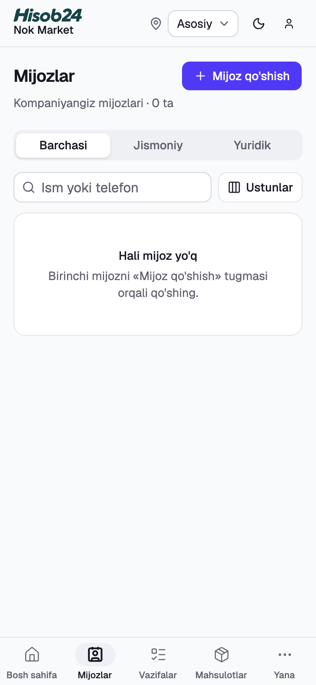</td>
<td valign="top">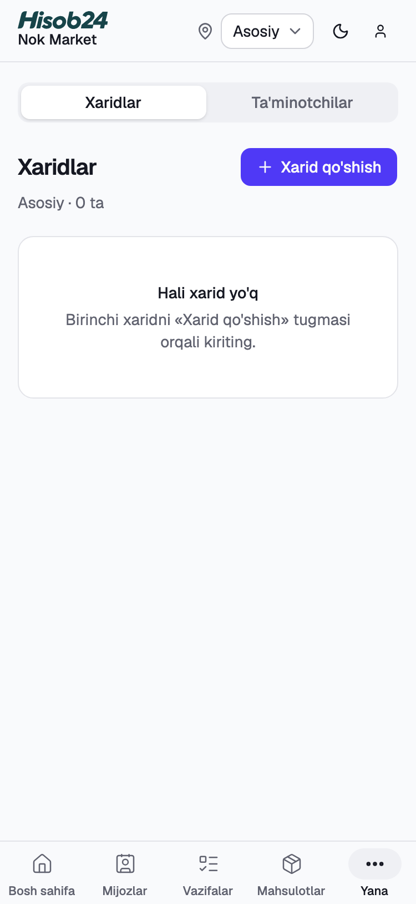</td>
<td valign="top">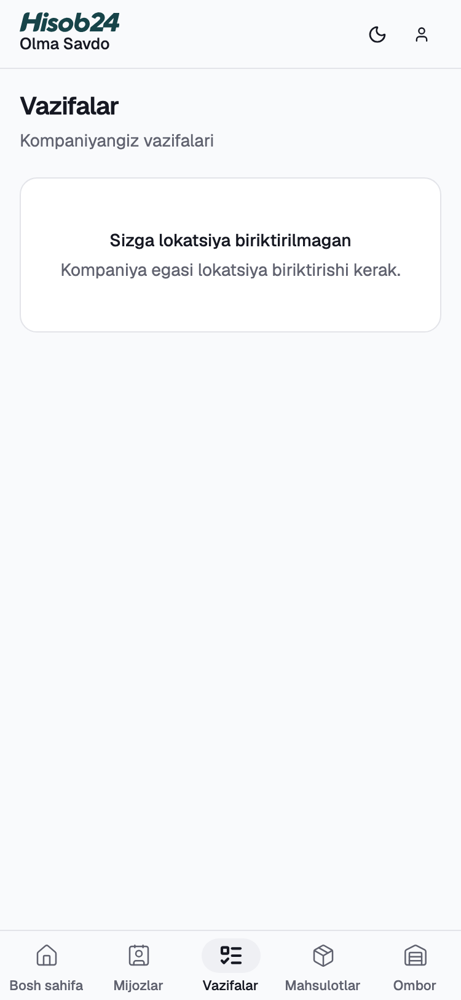</td>
</tr>
</table>

## 7. Ekranlar

| # | Ekran | Manzil |
|---|---|---|
| 7.1 | [Kirish](#71-kirish) | `/login` |
| 7.2 | [Telegram'da kirish ekranlari](#72-telegramda-kirish-ekranlari) | `/login` (Mini App) |
| 7.3 | [Kompaniyani tanlash](#73-kompaniyani-tanlash) | `/select-company` |
| 7.4 | [Obuna tugagan](#74-obuna-tugagan) | `/expired` |
| 7.5 | [Bosh sahifa](#75-bosh-sahifa) | `/` |
| 7.6 | [Mijozlar ro'yxati](#76-mijozlar-royxati) | `/customers` |
| 7.7 | [Mijoz qo'shish va tahrirlash](#77-mijoz-qoshish-va-tahrirlash) | dialog |
| 7.8 | [Mijoz sahifasi](#78-mijoz-sahifasi) | `/customers/[id]` |
| 7.9 | [Vazifalar: kanban](#79-vazifalar-kanban) | `/tasks` |
| 7.10 | [Vazifalar: ro'yxat](#710-vazifalar-royxat) | `/tasks?view=list` |
| 7.11 | [Vazifa qo'shish va tahrirlash](#711-vazifa-qoshish-va-tahrirlash) | dialog |
| 7.12 | [Vazifa sahifasi](#712-vazifa-sahifasi) | `/tasks/[id]` |
| 7.13 | [Mahsulotlar](#713-mahsulotlar) | `/products` |
| 7.14 | [Xizmatlar](#714-xizmatlar) | `/services` |
| 7.15 | [Mahsulot sahifasi](#715-mahsulot-sahifasi) | `/products/[id]` |
| 7.16 | [Xaridlar](#716-xaridlar) | `/purchases` |
| 7.17 | [Xarid sahifasi](#717-xarid-sahifasi) | `/purchases/[id]` |
| 7.18 | [Xarid formasi](#718-xarid-formasi) | `/purchases/new`, `/purchases/[id]/edit` |
| 7.19 | [Ta'minotchilar](#719-taminotchilar) | `/suppliers` |
| 7.20 | [Ta'minotchi sahifasi](#720-taminotchi-sahifasi) | `/suppliers/[id]` |
| 7.21 | [Xodimlar](#721-xodimlar) | `/employees` |
| 7.22 | [Sozlamalar](#722-sozlamalar) | `/settings` |
| 7.23 | [Mijoz turi va vazifa turi](#723-mijoz-turi-va-vazifa-turi) | `/settings/customer-types/[id]`, `/settings/task-types/[id]` |
| 7.24 | [Dropdown sahifasi](#724-dropdown-sahifasi) | `/settings/dropdowns/[id]` |
| 7.25 | [Rol sahifasi](#725-rol-sahifasi) | `/settings/roles/new`, `/settings/roles/[id]` |

### 7.1. Kirish

`/login` · hamma · brauzerda kirish (Telegram ichidagisi: [7.2](#72-telegramda-kirish-ekranlari)).

**Tuzilishi.** Ekran ikki qismdan iborat:

- **Brend paneli** `#174449`: oq logotip, «Biznesingiz uchun hisob tizimi» va fonda katta, chetidan kesilgan «24» raqami.
- **Forma.** 1024 px dan panel chapda (5 : 6), forma o'ngda. Undan torda panel tepada tasma, forma uning ostidan yumaloq burchakli varaq bo'lib chiqadi.

**1-qadam.**

- Sarlavha «Kirish», izoh «Telefon raqamingizni kiriting, kod SMS orqali keladi».
- «Telefon raqami» maydoni `+998 __ ___ __ __` niqobi bilan, 48 px.
- «Kodni olish» tugmasi, 48 px.
- Xatolar: «Telefon raqamini to'liq kiriting», «Kodni qayta olish uchun bir daqiqa kuting».

**2-qadam.**

- Sarlavha «Kodni kiriting», izoh «Kod +998 90 123 45 67 raqamiga yuborildi».
- 6 ta alohida katak (56 px). Oltinchi raqamda o'zi yuboriladi.
- «Kodni qayta yuborish (60)» (konturli, sanoq bilan) va «Raqamni o'zgartirish».
- Xato: «Kod noto'g'ri yoki muddati o'tgan» (kataklar tozalanadi).

<table>
<tr><th>Telefon: 1-qadam</th><th>Telefon: 2-qadam</th></tr>
<tr>
<td valign="top">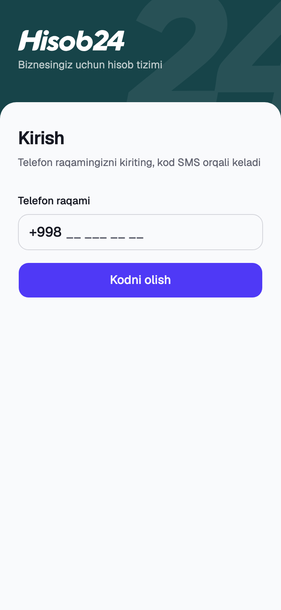</td>
<td valign="top">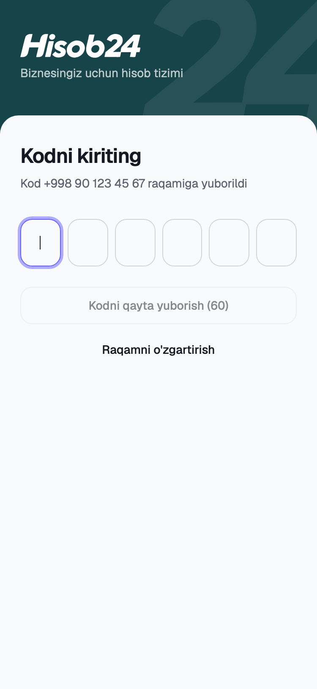</td>
</tr>
</table>

<table>
<tr><th>Desktop: 1-qadam</th><th>Desktop: 2-qadam</th></tr>
<tr>
<td valign="top">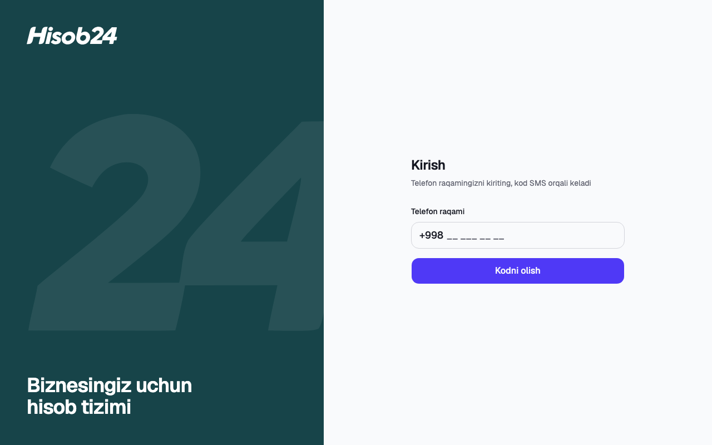</td>
<td valign="top">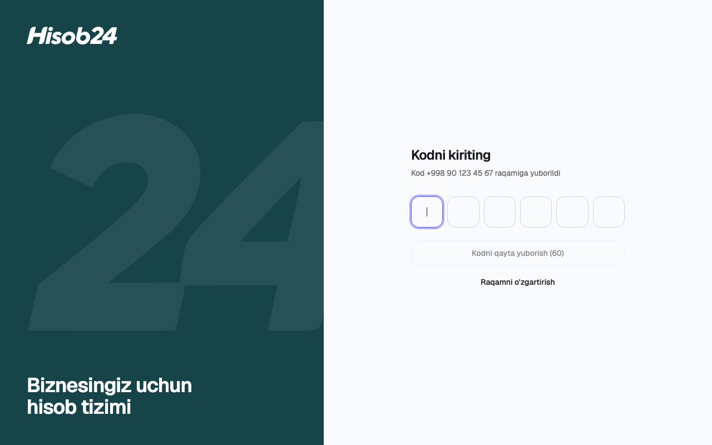</td>
</tr>
</table>

### 7.2. Telegram'da kirish ekranlari

`/login` Mini App ichida · hamma. Forma o'rniga holat ekranlari: tepada logotip, sarlavha, izoh va bitta tugma. Ranglar Telegram chat mavzusidan.

| Holat | Sarlavha | Matn | Tugma |
|---|---|---|---|
| Tekshirilmoqda | — | «Telegram orqali kirilmoqda…» | — |
| Raqam ulanmagan | «Telefon raqamingiz ulanmagan» | «Hisob24'ga kirish uchun Telegram raqamingizni botga yuboring.» | «Raqamni yuborish» |
| Raqam hali kelmadi | «Telefon raqamingiz ulanmagan» | «Raqam hali yetib kelmadi.» | «Qayta urinish» |
| Telegram raqam so'rashni qo'llamaydi | «Telefon raqamingiz ulanmagan» | «Botga qaytib, /start yozing va raqamingizni yuboring.» | «Botga qaytish» |
| A'zo emas | «Kirish huquqi yo'q» | «Hisob24'ga kirish huquqingiz yo'q. Raqamingiz: +998 … Kompaniyangiz administratoriga murojaat qiling.» | «Yopish» |
| Sessiya saqlanmadi | «Kirib bo'lmadi» | xato matni | «Yopish» |

<table>
<tr><th>Kirish huquqi yo'q</th><th>Raqam ulanmagan</th></tr>
<tr>
<td valign="top">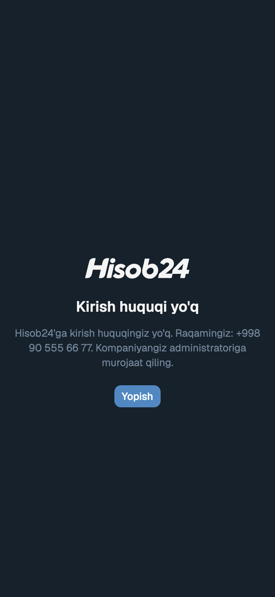</td>
<td valign="top">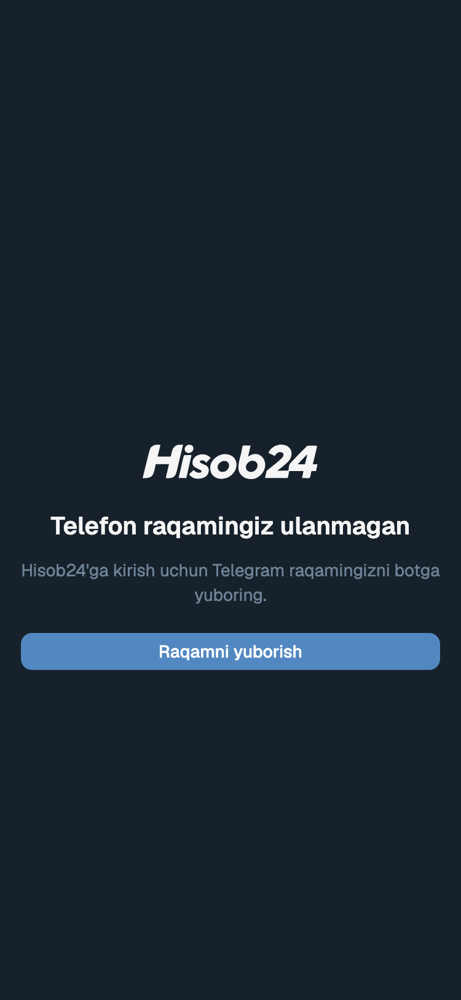</td>
</tr>
</table>

### 7.3. Kompaniyani tanlash

`/select-company` · 2+ kompaniyali a'zo.

- Tepada logotip, «Kompaniyani tanlang», «Qaysi kompaniyada ishlaysiz?».
- Kompaniya kartalari: nom, ostida rol («Egasi», «Xodim» yoki rol nomi). Faol kompaniyada o'ng tomonda «›», muddati o'tganida qizil «Muddati o'tgan», bloklanganida neytral «Bloklangan» belgisi; ular xira va bosilmaydi.
- Pastda «Chiqish».
- Hech bir kompaniya faol bo'lmasa: «Faol kompaniya yo'q».

Ekranda Sardor Karimov: uchta kompaniyasi bor.

<table>
<tr><th>Telefon</th><th>Desktop</th></tr>
<tr>
<td valign="top">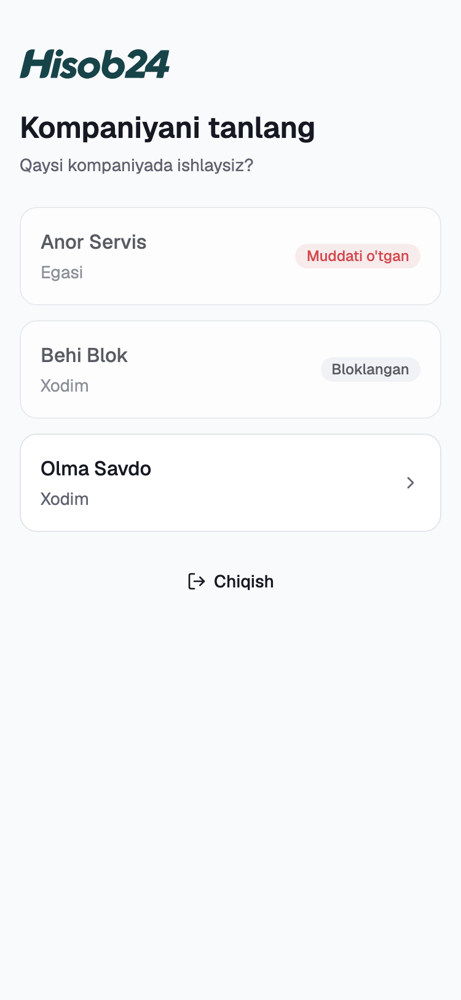</td>
<td valign="top">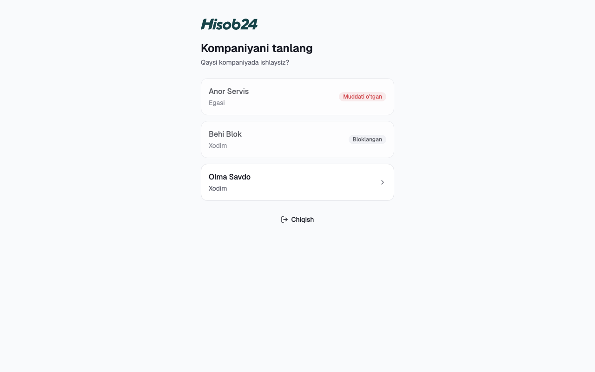</td>
</tr>
</table>

### 7.4. Obuna tugagan

`/expired` · obunasi tugagan yoki bloklangan kompaniya a'zosi.

- O'rtada logotip, qizil kalendar ikonkasi, «Obuna muddati tugagan».
- Izoh: «Kompaniya obunasini uzaytirish uchun administrator bilan bog'laning.»
- «Boshqa kompaniyani tanlash» (har doim; `/select-company` ga olib boradi) va «Chiqish» (Telegram ichida yo'q).

<table>
<tr><th>Telefon</th><th>Desktop</th></tr>
<tr>
<td valign="top">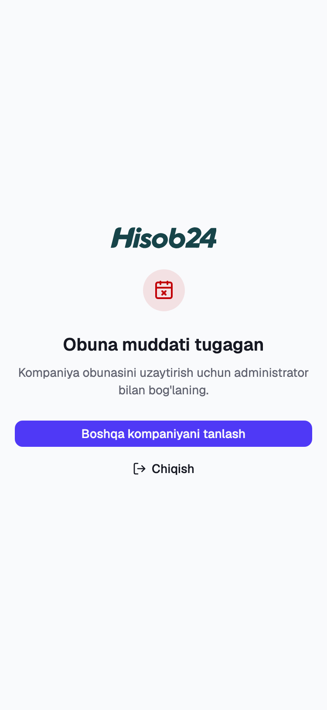</td>
<td valign="top">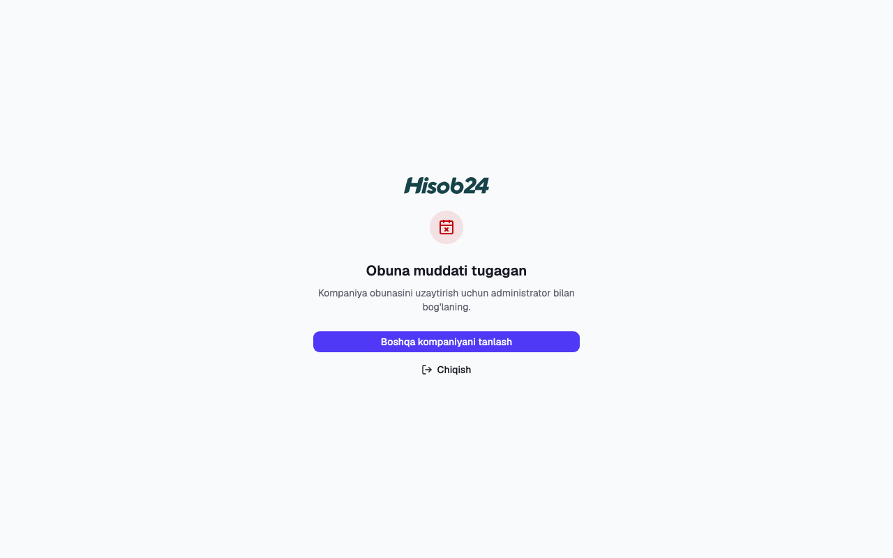</td>
</tr>
</table>

### 7.5. Bosh sahifa

`/` · hamma a'zo.

Hozircha minimal: statistika va vidjetlar yo'q.

- «Salom, {ism}» (shu kompaniyadagi ismi).
- Kompaniya kartasi: «Kompaniya», nomi va rol belgisi («Egasi» indigo nuqta bilan; «Xodim» yoki rol nomi neytral). Karta 672 px gacha, chapdan boshlanadi.
- 2+ faol kompaniya bo'lsa, «Kompaniyani almashtirish» (konturli, to'liq enda).

<table>
<tr><th>Telefon</th><th>Desktop</th></tr>
<tr>
<td valign="top"></td>
<td valign="top">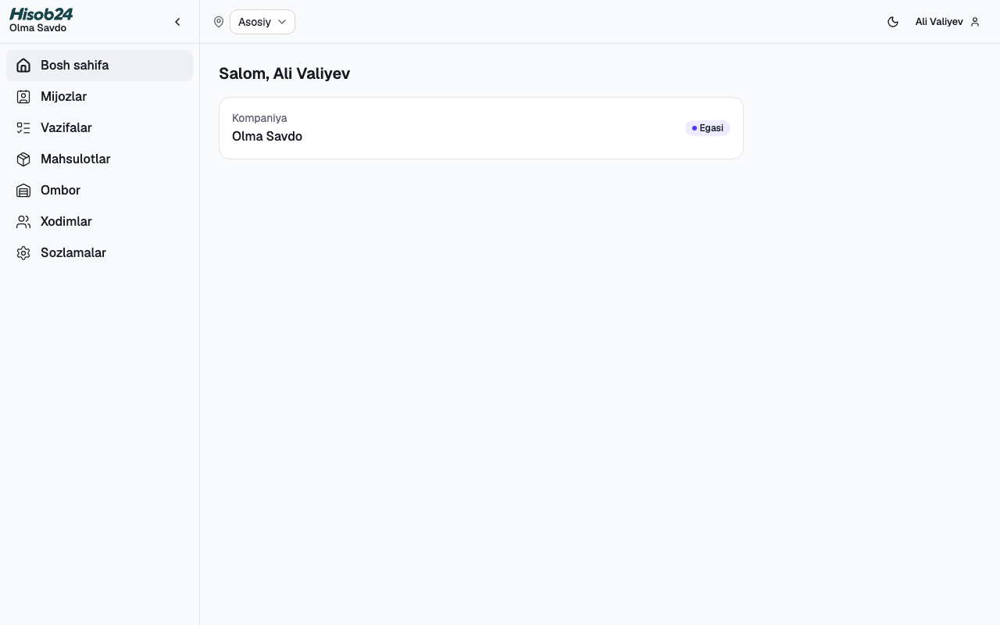</td>
</tr>
</table>

Dark mavzu va Telegram ichida:

<table>
<tr><th>Dark, telefon</th><th>Telegram Mini App</th><th>Dark, desktop</th></tr>
<tr>
<td valign="top">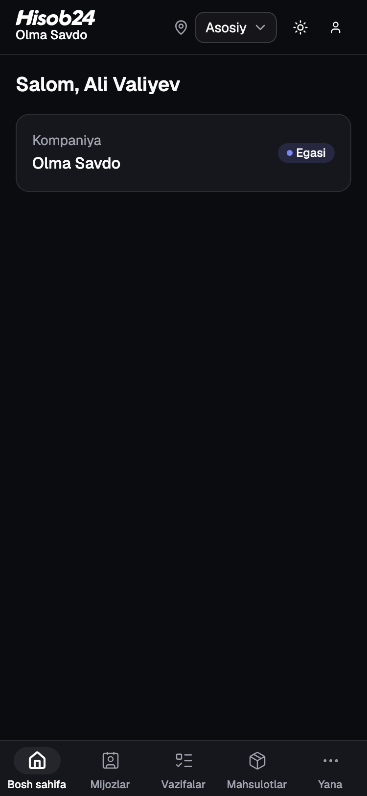</td>
<td valign="top">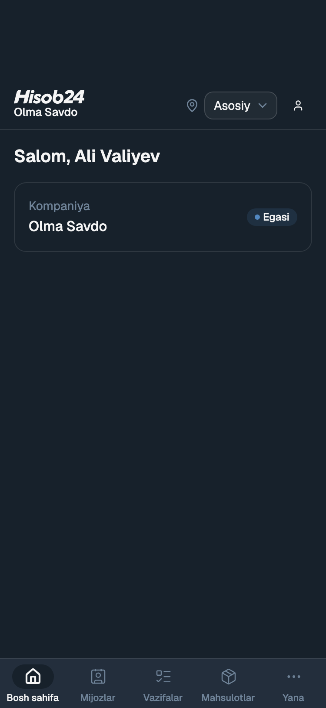</td>
<td valign="top">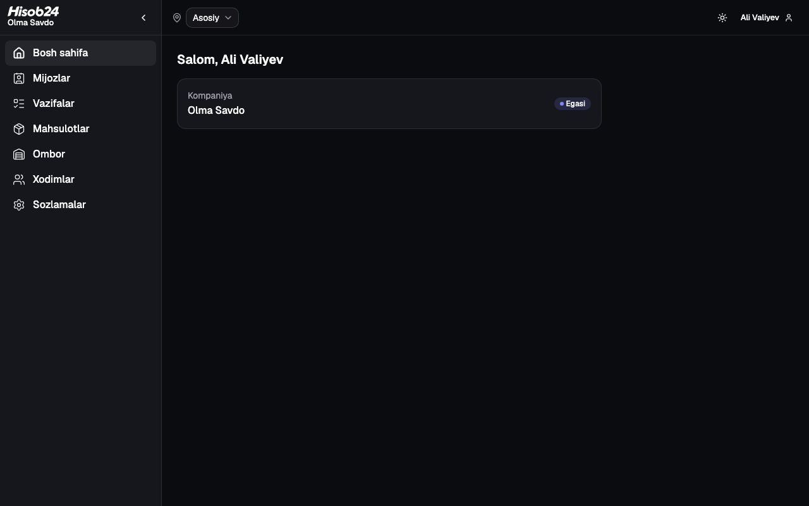</td>
</tr>
</table>

Mini App skrinshotidagi tepadagi bo'sh joy Telegram'ning status bar va suzuvchi tugmalari uchun (to'liq ekran rejimi, [9.1](#91-mini-app)).

### 7.6. Mijozlar ro'yxati

`/customers` · Mijozlar «Ko'rish».

- **Sarlavha:** «Mijozlar», «Kompaniyangiz mijozlari · N ta», «Mijoz qo'shish».
- **Asboblar:**
  - tur tablari («Barchasi» va kompaniyaning turlari);
  - qidiruv «Ism yoki telefon»: matn maydonlarida qidiradi, faqat raqam yozilsa telefon va son maydonlarida ham;
  - «Ustunlar» menyusi: «Ko'rinadigan ustunlar» checkboxlari.
- **Jadval ustunlari:**
  - «Mijoz»: avatar (bosh harflar), nom, ostida telefon; mijoz sahifasiga havola;
  - «Turi» (belgi);
  - turlarning maydonlari: bir xil nomli maydonlar bitta ustun, nom maydoni ustun emas;
  - «Qo'shgan», «Qo'shilgan».
- **Tartib:** eng yangisi birinchi, 20 tadan.
- **Kartochka (telefon):** avatar, nom va telefon; tur belgisi va «Qo'shilgan»; to'ldirilgan maydonlar «nom — qiymat» bo'lib; «Qo'shgan». Butun karta bosiladi.
- **Tur filtri tanlansa,** ustunlar shu turning maydonlari bo'ladi.
- **Holatlar:**
  - bo'sh ro'yxat ([6.4](#64-holatlar));
  - kompaniyada mijoz turi qolmasa: egasiga «Sozlamalarni ochish» havolasi, xodimga «Kompaniya egasi mijoz turlarini sozlashi kerak».

<table>
<tr><th>Telefon</th><th>Desktop</th></tr>
<tr>
<td valign="top">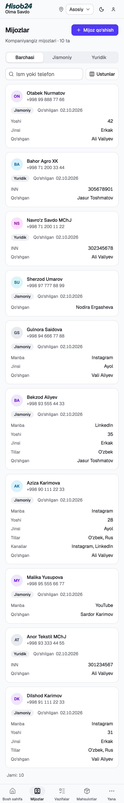</td>
<td valign="top">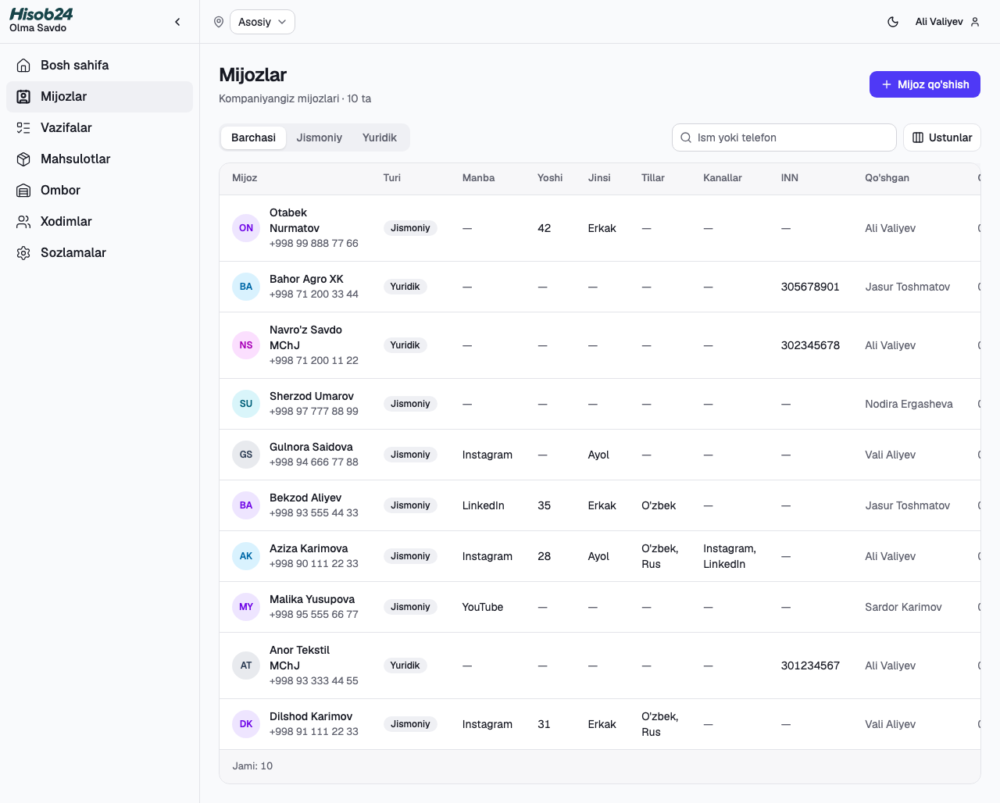  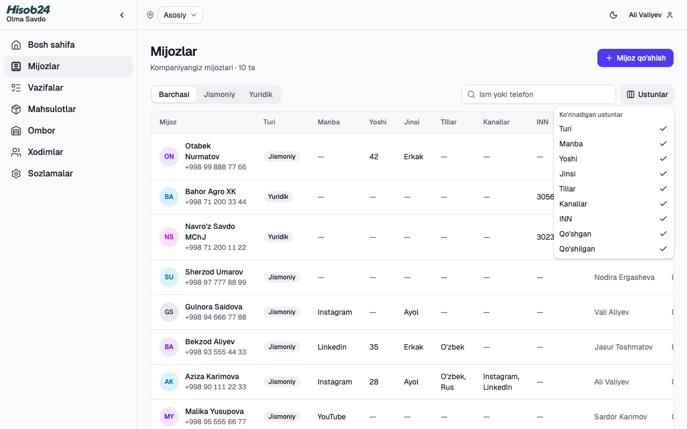</td>
</tr>
</table>

### 7.7. Mijoz qo'shish va tahrirlash

Dialog · Mijozlar «Qo'shish» / «Tahrirlash».

- **Sarlavha** «Mijoz qo'shish», izoh «Turni tanlang va shu turning maydonlarini to'ldiring.» Tahrirda «Mijozni tahrirlash»; tur o'zgarmaydi.
- **Tur tugmalari** (bittasi tanlanadi): forma tanlangan turning maydonlariga almashadi. Dialog birinchi tur bilan ochiladi; ro'yxatda tur tabi tanlangan bo'lsa, o'sha tur bilan.
- **«Telefon raqami»:** har doim bor va majburiy.
- **Turning maydonlari** sozlamadagi tartibda. Majburiy bo'lmaganida o'ngda xira «ixtiyoriy» turadi. Maydon turlari bo'yicha boshqaruvlar:
  - matn: oddiy maydon;
  - butun son: raqamli klaviatura;
  - dropdown: select, «Tanlanmagan» bilan;
  - ko'p tanlovli dropdown: ko'p tanlovli select;
  - radio: radio guruh, «Tanlanmagan» bilan;
  - checkbox: checkbox guruh.
- **Tugma** «Qo'shish» yoki «Saqlash» (telefonda to'liq enda).
- **Rad javobi:** takror telefon: «Bu raqamli mijoz allaqachon bor»; takrorlanmas maydon: «Bu «INN» boshqa mijozda bor». Ikkalasida «Mijozni ochish» havolasi bor.

Ekrandagi turda olti xil maydonning hammasi bor (F.I.Sh., Manba, Yoshi, Jinsi, Tillar, Kanallar).

<table>
<tr><th>Telefon</th><th>Desktop</th></tr>
<tr>
<td valign="top">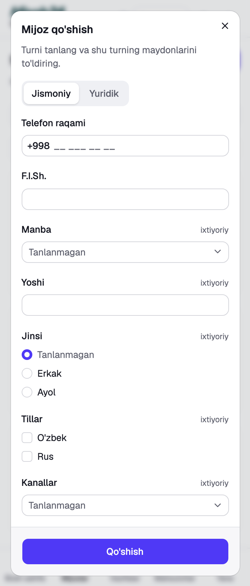</td>
<td valign="top">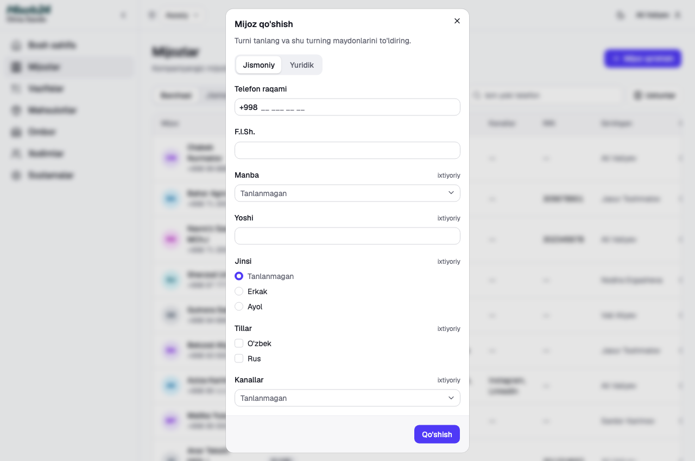</td>
</tr>
</table>

### 7.8. Mijoz sahifasi

`/customers/[id]` · Mijozlar «Ko'rish».

- **Sarlavha.** «← Mijozlar»; avatar va nom; izoh «Jismoniy · +998 91 111 22 33».
- **Amallar.** «Tahrirlash» (asosiy) va «O'chirish» (konturli, tasdiq «Mijozni o'chirasizmi?»).
- **«Ma'lumot».** Telefon, turning hamma maydonlari tartibda (bo'shi «—»), «Qo'shgan», «Qo'shilgan».
- **«Vazifalar»** (Vazifalar «Ko'rish» bilan):
  - mijozning ruxsatli hamma lokatsiyadagi vazifalari;
  - ustunlar «Vazifa», «Bosqich» (rangli belgi), «Lokatsiya» (2+ lokatsiyada), «Muddat»;
  - footer «Jami: N»;
  - bo'sh: «Bu mijozda vazifa yo'q».
- **«Tarix»** (egasi va Mijozlar «Tarix» ruxsati):
  - yozuvlar yangisi birinchi;
  - har yozuvda amal («Qo'shildi» yoki «Tahrirlandi»), kim va qachon;
  - tahrirda har o'zgargan maydon: nomi va «eski → yangi».
- **O'chirish.** Vazifasi bor mijoz o'chirilmaydi: toast «Bu mijozda N ta vazifa bor».
- **Topilmasa:** «Mijoz topilmadi».

<table>
<tr><th>Telefon</th><th>Desktop</th></tr>
<tr>
<td valign="top">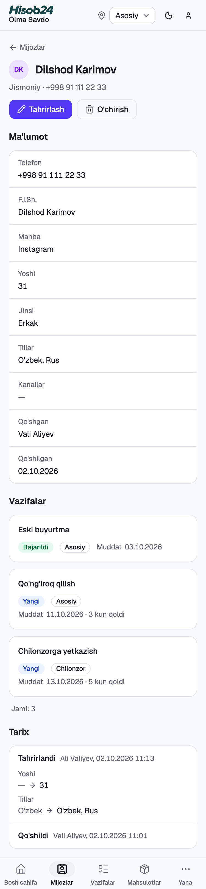</td>
<td valign="top">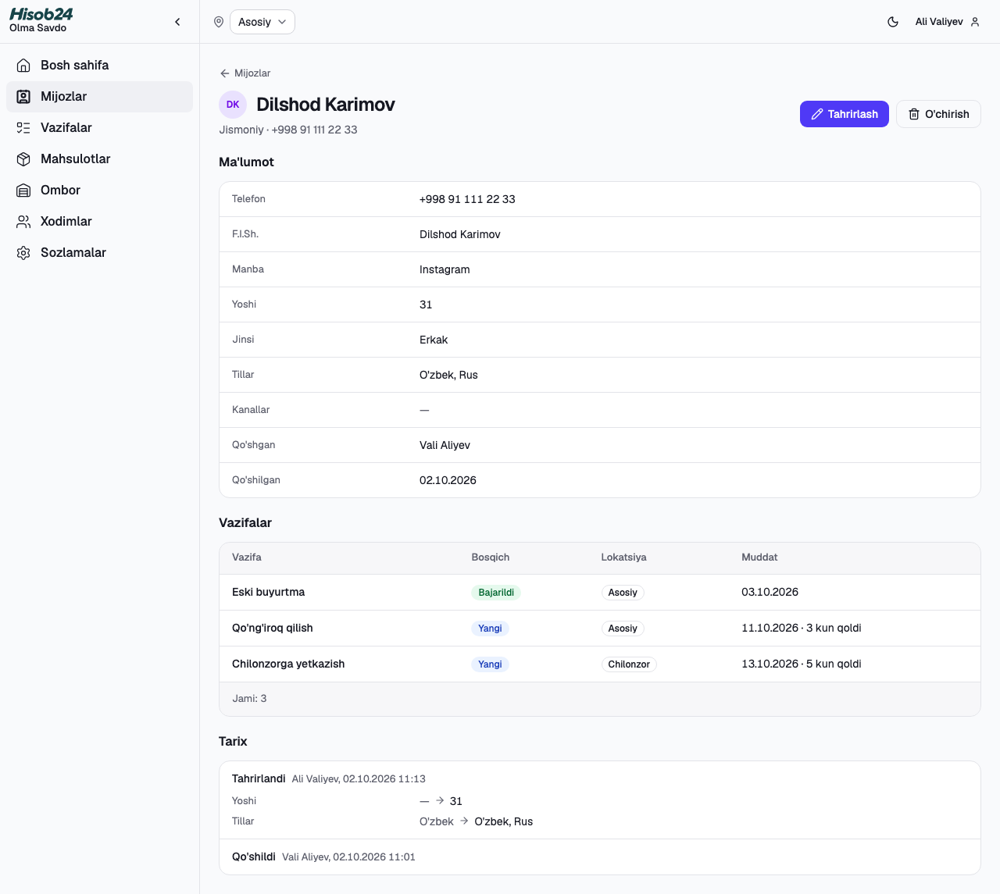</td>
</tr>
</table>

### 7.9. Vazifalar: kanban

`/tasks` · Vazifalar «Ko'rish». Birinchi kirishda kanban ochiladi, keyin oxirgi tanlangan ko'rinish eslanadi.

- **Sarlavha.** «Vazifalar», «Kompaniyangiz vazifalari · N ta», «Vazifa qo'shish».
- **Asboblar.**
  - tur tablari («Barchasi», «Vazifa», «Buyurtma» va h.k.);
  - qidiruv «Nomi, mijoz yoki telefon»: vazifa nomi, vazifa va mijoz maydonlari, mijoz telefoni bo'yicha;
  - mas'ul select'i: «Barcha mas'ullar», «Men» va a'zolar;
  - «Ro'yxat | Kanban» almashtirgichi.
- **Ustunlar.** Bosqichlar sozlamadagi tartibda yonma-yon. Ustun sarlavhasida rang nuqtasi, nom, soni va «+» (shu bosqich tanlangan qo'shish dialogi).
- **Karta.**
  - nom (havola) va mijoz nomi;
  - muddat «dd.mm.yyyy · N kun qoldi», kechikkan bo'lsa qizil;
  - mas'ul;
  - «Barchasi» tabida tur belgisi;
  - «⋮» bosqich menyusi.
- **Sudrash.** Karta boshqa ustunga sichqoncha yoki barmoq bilan tashlanadi. Bosqich ichida tartib qo'lda emas: muddati yaqini tepada.
- **Yakuniy bosqich** («Bajarildi») ustuni yig'ilgan turadi: tor ustun, vertikal nom va soni. Bosilsa ochiladi, holati eslanadi. Unga ham tashlash mumkin.
- **Ustun ostida** «Jami: N» va keyingi 20 ta uchun «Yana».
- **Telefonda** bitta ustun ekran enining ~85 % ini oladi, qolganlari yonga suriladi (snap).
- **Lokatsiya.** Faqat joriy lokatsiya vazifalari ko'rinadi.

<table>
<tr><th>Telefon</th><th>Desktop</th></tr>
<tr>
<td valign="top">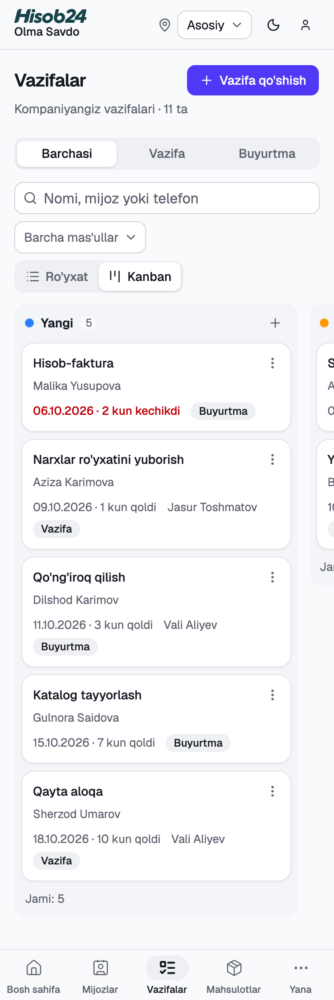</td>
<td valign="top">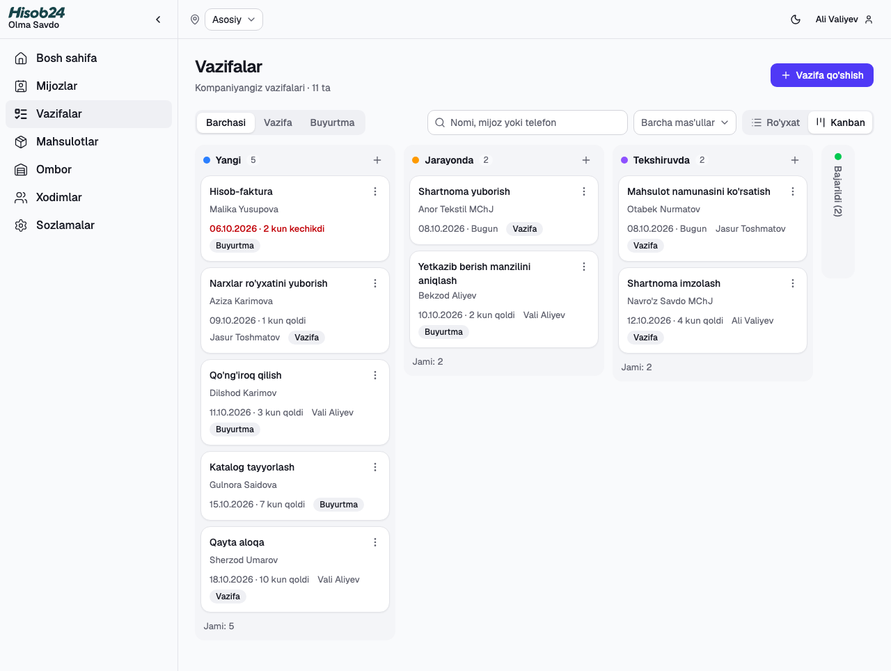</td>
</tr>
</table>

<table>
<tr><th>Dark, telefon</th><th>Telegram Mini App</th><th>Dark, desktop</th></tr>
<tr>
<td valign="top">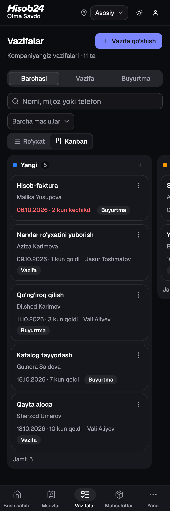</td>
<td valign="top">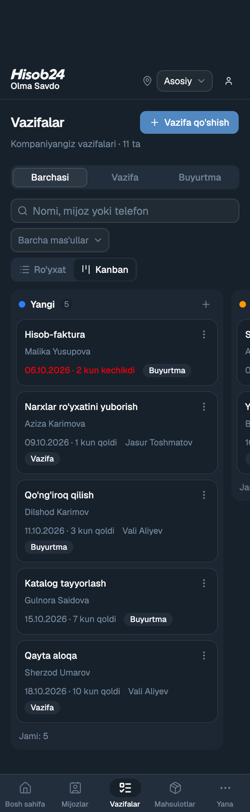</td>
<td valign="top">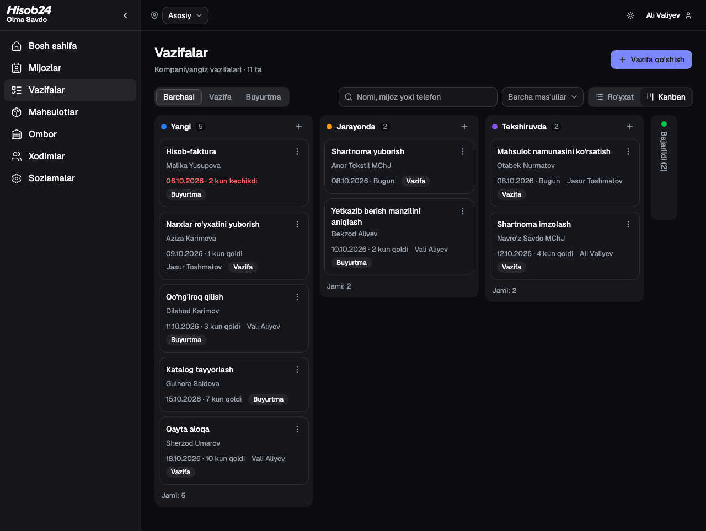</td>
</tr>
</table>

### 7.10. Vazifalar: ro'yxat

`/tasks?view=list` · Vazifalar «Ko'rish».

- **Asboblar.** Kanban'dagidek, qo'shimcha «Barcha bosqichlar» select va «Ustunlar» menyusi.
- **Jadval ustunlari:**
  - «Vazifa» (havola);
  - «Mijoz» (nom va telefon, mijoz sahifasiga havola);
  - «Turi», «Bosqich» (rangli belgi), «Muddat», «Mas'ul»;
  - turlarning maydonlari;
  - «Qo'shgan», «Qo'shilgan».
- **Tartib:** muddati yaqini birinchi, 20 tadan.
- **Kartochka (telefon).** Nom; tur va bosqich belgilari; «Muddat …», «Qo'shilgan»; «Mijoz» (matn), «Mas'ul», maydonlar, «Qo'shgan». Butun karta vazifani ochadi.
- **Holatlar:**
  - lokatsiyasiz xodimga «Sizga lokatsiya biriktirilmagan» kartasi, qo'shish tugmasi yo'q;
  - bosqich yoki tur qolmasa: egasiga «Sozlamalarni ochish», xodimga «Kompaniya egasi bosqichlarni sozlashi kerak.»

<table>
<tr><th>Telefon</th><th>Desktop</th></tr>
<tr>
<td valign="top">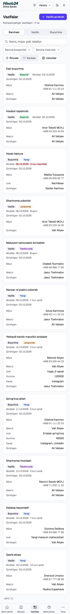</td>
<td valign="top">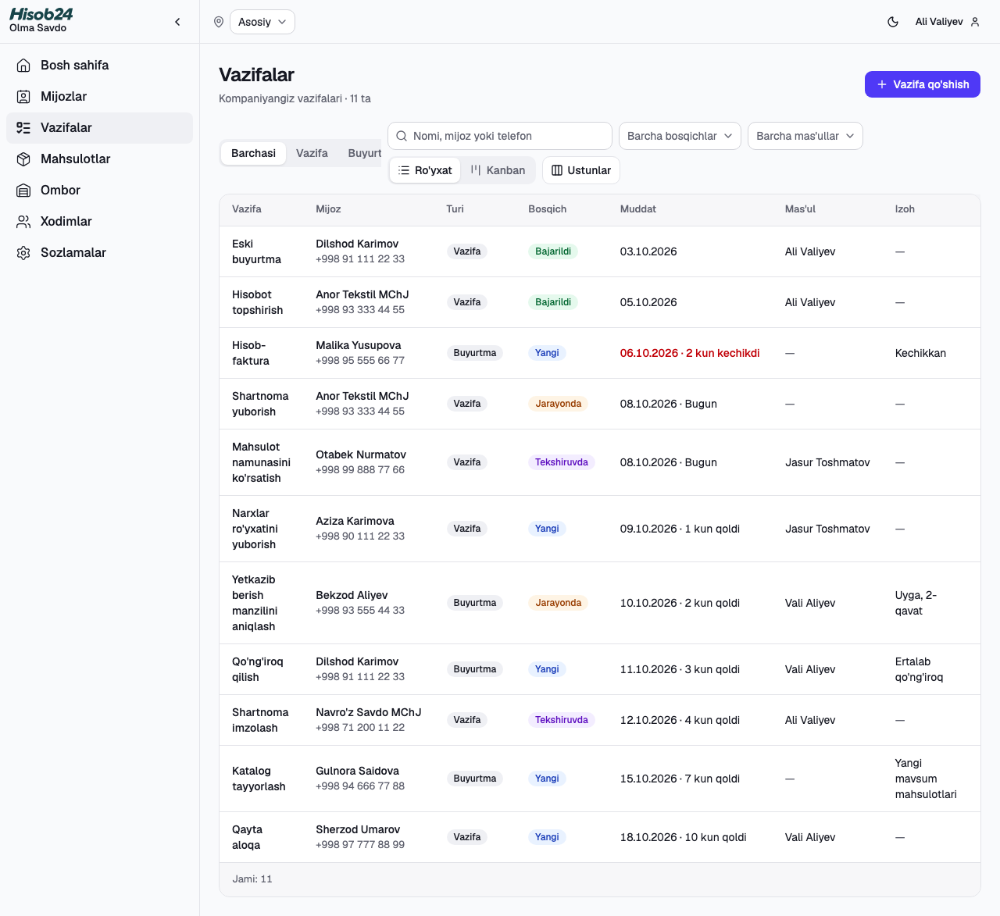</td>
</tr>
</table>

### 7.11. Vazifa qo'shish va tahrirlash

Keng dialog (768 px gacha) · Vazifalar «Qo'shish» / «Tahrirlash».

- **Sarlavha** «Vazifa qo'shish», izoh «Turni tanlang, mijozni biriktiring va vazifani to'ldiring.»
- **Tepada vazifa turi tugmalari.** Tur bitta bo'lsa, ular chiqmaydi.
- **768 px dan ikki ustun:** chapda «Mijoz», o'ngda «Vazifa». Telefonda ketma-ket: tur, mijoz, vazifa.
- **«Mijoz» qismi:**
  - mijoz turi tugmalari, «Telefon raqami», mijoz turining maydonlari;
  - 3+ raqam yozilganda telefon ostida takliflar chiqadi (5 tagacha: nom, telefon, tur);
  - mavjud mijoz tanlansa, «Mavjud mijoz» kartasi (havola) va «Boshqa mijoz» tugmasi chiqadi, mijoz maydonlari qulflanadi;
  - Mijozlar «Qo'shish» ruxsati bo'lmasa: «Yangi mijoz qo'shish ruxsatingiz yo'q: mavjud mijozni biriktiring.»
- **«Vazifa» qismi:**
  - «Nomi»;
  - «Muddat» (sana, bo'sh boshlanadi);
  - «Bosqich» (birinchi bosqich yoki «+» bosilgan ustun);
  - «Mas'ul» («Tanlanmagan» va shu lokatsiyada ishlaydigan a'zolar);
  - vazifa turining maydonlari.
- **Rad javobi.** Telefon boshqa mijozniki bo'lsa, «Shu mijozni biriktirish» va «Mijozni ochish».
- **Tahrirda** («Vazifani tahrirlash», izoh «{tur} · mijoz va tur o'zgarmaydi»):
  - chapda faqat «Mavjud mijoz» kartasi;
  - mas'ul ro'yxatida «Ism (chiqarilgan)» va «Ism (bu lokatsiyada ishlamaydi)» variantlari ham bo'lishi mumkin.

<table>
<tr><th>Telefon</th><th>Desktop</th></tr>
<tr>
<td valign="top">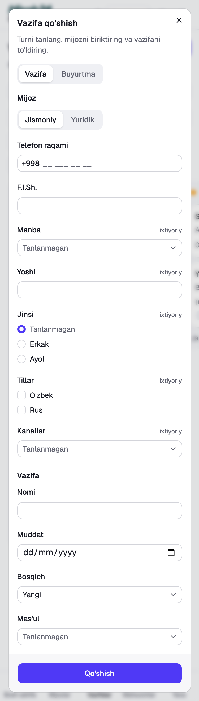</td>
<td valign="top">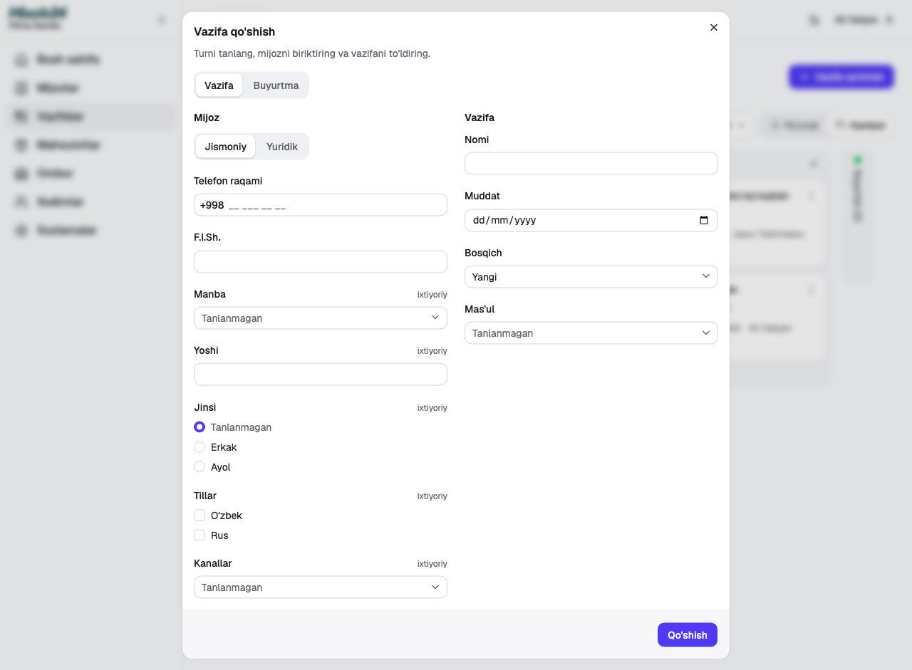</td>
</tr>
</table>

### 7.12. Vazifa sahifasi

`/tasks/[id]` · Vazifalar «Ko'rish».

- **Sarlavha.** «← Vazifalar»; vazifa nomi; izoh «Buyurtma · Yangi · 11.10.2026 · 3 kun qoldi» (kechikkan bo'lsa qizil).
- **Amallar.**
  - «Tahrirlash» (asosiy);
  - «O'chirish» (tasdiq «Vazifani o'chirasizmi?»);
  - «Bosqich» select: darhol o'zgaradi, toast «Bosqich o'zgartirildi».
- **«Mijoz».** Avatar, nom, «tur · telefon»; mijoz sahifasiga havola.
- **«Ma'lumot».** Nomi, Muddat, Bosqich, Lokatsiya (2+ lokatsiyada), Mas'ul, turning maydonlari, Qo'shgan, Qo'shilgan.
- **«Tarix»** (egasi va Vazifalar «Tarix» ruxsati). Bosqich o'zgarishi, muddat, mas'ul va maydonlar eski → yangi bo'lib yoziladi.

<table>
<tr><th>Telefon</th><th>Desktop</th></tr>
<tr>
<td valign="top">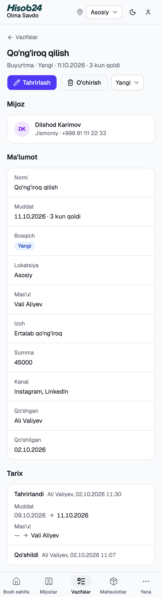</td>
<td valign="top">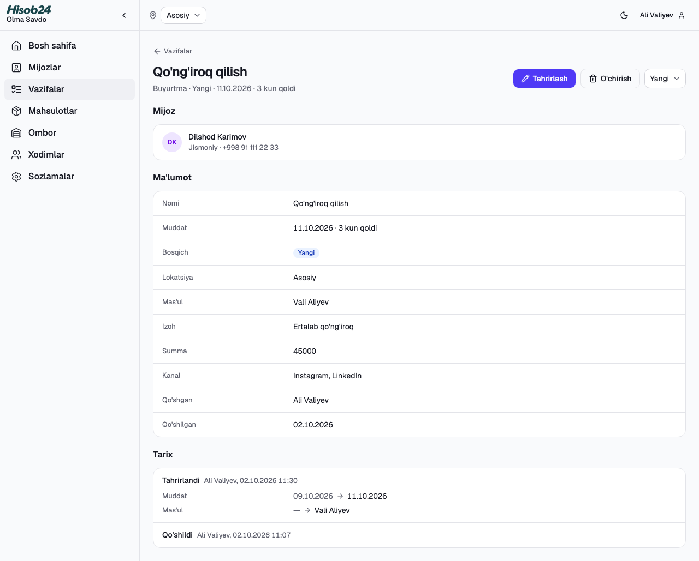</td>
</tr>
</table>

### 7.13. Mahsulotlar

`/products` · Mahsulotlar «Ko'rish».

- **Tepada** bo'lim tablari «Mahsulotlar | Xizmatlar».
- **Sarlavha.** «Mahsulotlar», «Kompaniyangiz mahsulotlari · N ta», «Mahsulot qo'shish».
- **Asboblar.** «Faol | Nofaol» tablari, qidiruv «Nom yoki artikul».
- **Jadval ustunlari:**
  - «Mahsulot» (havola);
  - «Artikul», «Birlik» (belgi), «Narx»;
  - «Qoldiq» (joriy lokatsiyadagi, birlik bilan: «12,5 kg»);
  - «Qo'shgan», «Qo'shilgan».
- **Tartib:** nom bo'yicha.
- **Kartochka (telefon).** Nom, o'ngda narx; birlik belgisi, «Artikul …», «Qoldiq …», «Qo'shilgan»; «Qo'shgan».
- **Mahsulot dialogi:**
  - «Mahsulot qo'shish», izoh «Nom va birlik majburiy; sotuv narxi, artikul va izoh ixtiyoriy.»;
  - maydonlar «Nomi», «Birlik» (select, «Tanlang»), «Sotuv narxi», «Artikul», «Izoh».
- **Nofaol mahsulot** xarid formasidagi takliflarda chiqmaydi, ammo qoldig'i va xaridlari ko'rinadi.

<table>
<tr><th>Telefon</th><th>Mahsulot qo'shish</th><th>Desktop</th></tr>
<tr>
<td valign="top">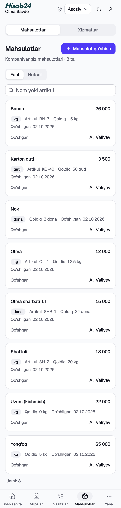</td>
<td valign="top">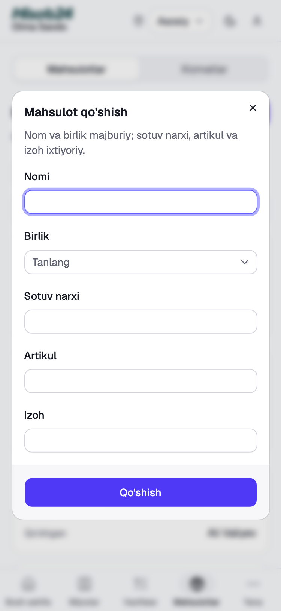</td>
<td valign="top">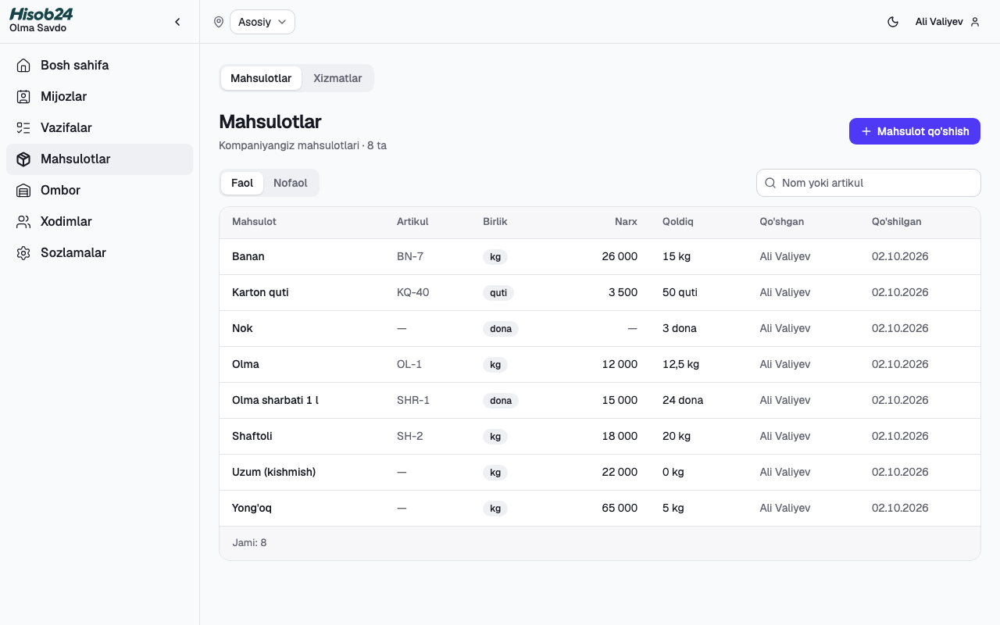</td>
</tr>
</table>

### 7.14. Xizmatlar

`/services` · Mahsulotlar «Ko'rish».

- **Sarlavha.** «Xizmatlar», «Kompaniyangiz xizmatlari · N ta», «Xizmat qo'shish».
- **Asboblar.** «Faol | Nofaol», qidiruv «Nom».
- **Jadval ustunlari.** «Xizmat», «Narx», «Qo'shgan», «Qo'shilgan» va qator amallari (ikonkalar): tahrirlash, nofaol qilish, o'chirish.
- **Xizmatning alohida sahifasi yo'q.** U birliksiz va artikulsiz, omborga kirmaydi.
- **Dialog.** «Xizmat qo'shish», izoh «Nom majburiy; narx va izoh ixtiyoriy.»

<table>
<tr><th>Telefon</th><th>Desktop</th></tr>
<tr>
<td valign="top">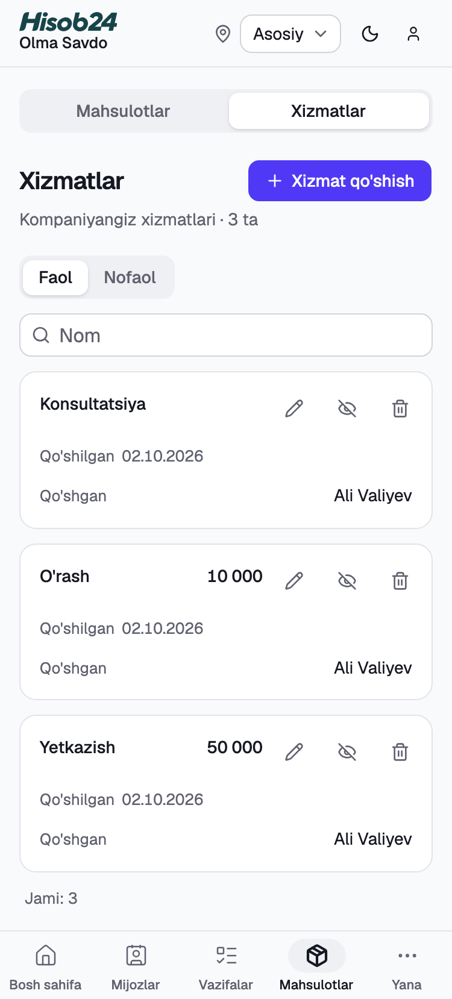</td>
<td valign="top">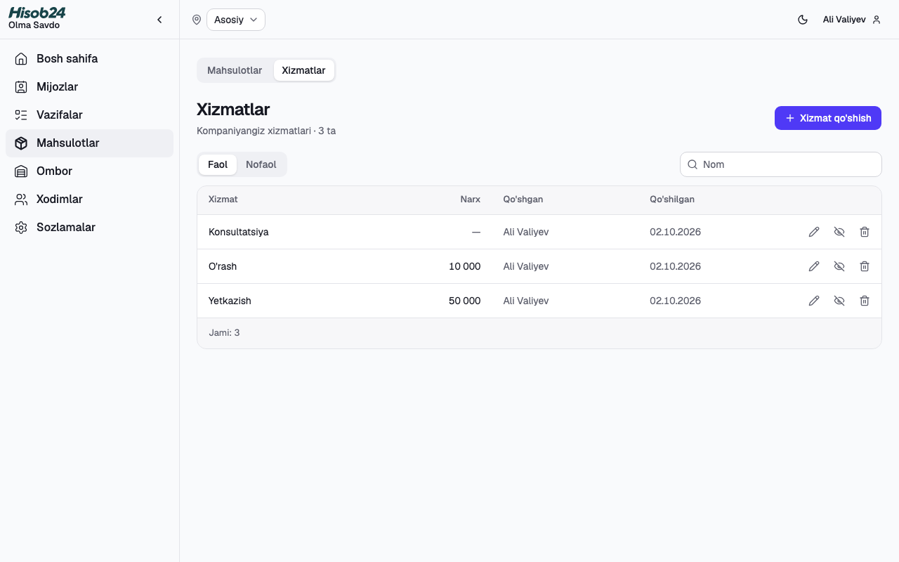</td>
</tr>
</table>

### 7.15. Mahsulot sahifasi

`/products/[id]` · Mahsulotlar «Ko'rish».

- **Sarlavha.** «← Mahsulotlar»; nom (nofaol bo'lsa «Nofaol» belgisi); izoh «kg · OL-1» (birlik · artikul).
- **Amallar.**
  - «Tahrirlash»;
  - «Nofaol qilish» / «Faollashtirish»;
  - «O'chirish». Xaridi bor mahsulot o'chirilmaydi: toast «Bu mahsulot N ta xaridda bor».
- **«Ma'lumot».** Birlik, Narx, Oxirgi xarid narxi, Artikul, Izoh, Qo'shgan, Qo'shilgan.
- **«Qoldiq».** Ruxsatli har lokatsiya nomi va miqdori (0 ham).
- **«Xaridlar»** (Xaridlar «Ko'rish» bilan):
  - ustunlar «Xarid» («№ 3 · Toshkent Meva»), «Sana», «Lokatsiya» (2+ lokatsiyada), «Miqdor», «Narx, so'm», «Summa, so'm»;
  - bo'sh: «Bu mahsulot hali xarid qilinmagan».

<table>
<tr><th>Telefon</th><th>Desktop</th></tr>
<tr>
<td valign="top">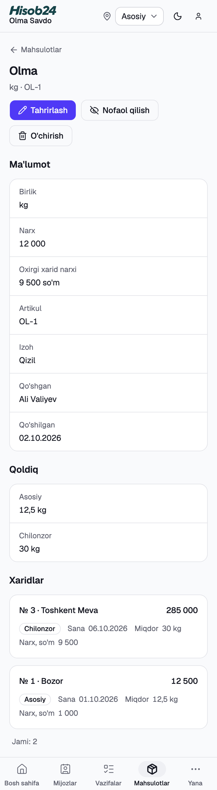</td>
<td valign="top">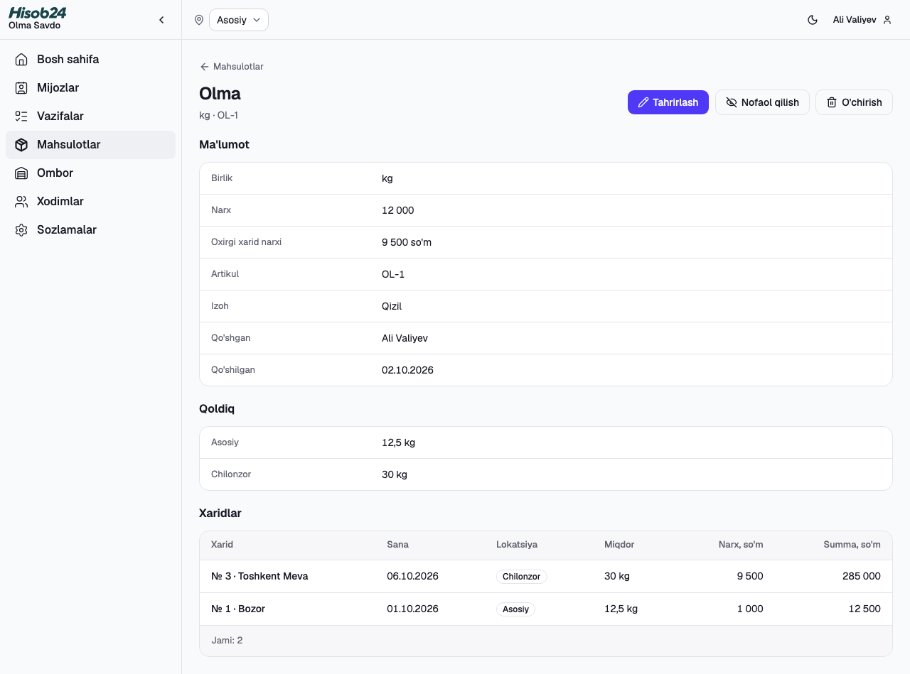</td>
</tr>
</table>

### 7.16. Xaridlar

`/purchases` · Xaridlar «Ko'rish».

- **Tepada** bo'lim tablari «Xaridlar | Ta'minotchilar».
- **Sarlavha.** «Xaridlar», izohda joriy lokatsiya va soni («Asosiy · 3 ta»), «Xarid qo'shish».
- **Filtr yo'q.** Ro'yxat joriy lokatsiyaniki, lokatsiya almashsa 1-sahifadan.
- **Jadval ustunlari:**
  - «Xarid»: «№ 4 · Bozor», ostida «08.10.2026 · 2 ta mahsulot»; havola;
  - «Jami, so'm», «To'langan, so'm», «Qo'shgan».
- **Tartib:** sana bo'yicha yangisi birinchi.
- **Kartochka (telefon).** «№ 4 · Bozor» va o'ngda jami; sana · mahsulotlar soni; «To'langan, so'm»; «Qo'shgan».
- **Bo'sh:** «Hali xarid yo'q» / «Birinchi xaridni «Xarid qo'shish» tugmasi orqali kiriting.» Lokatsiyasiz a'zoga «Sizga lokatsiya biriktirilmagan».

<table>
<tr><th>Telefon</th><th>Desktop</th></tr>
<tr>
<td valign="top">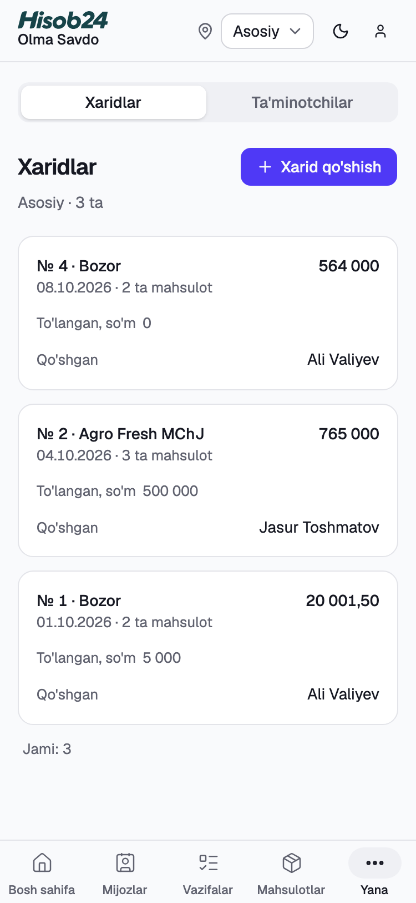</td>
<td valign="top">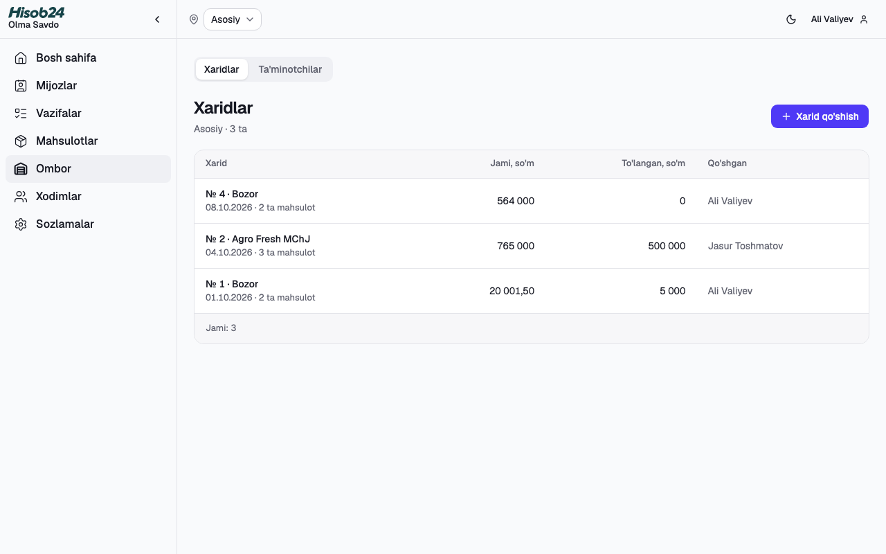</td>
</tr>
</table>

### 7.17. Xarid sahifasi

`/purchases/[id]` · Xaridlar «Ko'rish».

- **Sarlavha.** «← Xaridlar»; «Xarid № 2»; izoh «Agro Fresh MChJ · 04.10.2026».
- **Amallar.**
  - «Tahrirlash»: forma sahifasiga o'tadi;
  - «O'chirish»: tasdiq «Xaridni o'chirasizmi?», izoh «№ 2 xaridi o'chiriladi, qoldiq qaytariladi. Qayta tiklab bo'lmaydi.»
- **«Ma'lumot».** Ta'minotchi (havola), Sana, Lokatsiya (2+ lokatsiyada), Jami, To'langan, Izoh, Qo'shgan, Qo'shilgan.
- **«Qatorlar».** «Mahsulot» (havola), «Miqdor» (birlik bilan), «Narx, so'm», «Summa, so'm»; footer «Jami: 765 000».

<table>
<tr><th>Telefon</th><th>Desktop</th></tr>
<tr>
<td valign="top">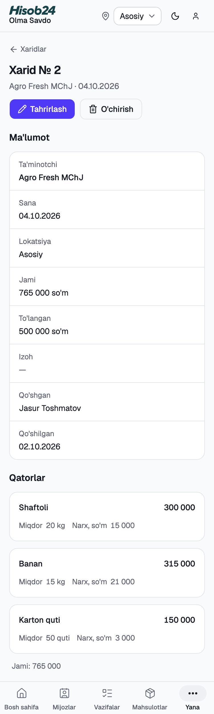</td>
<td valign="top">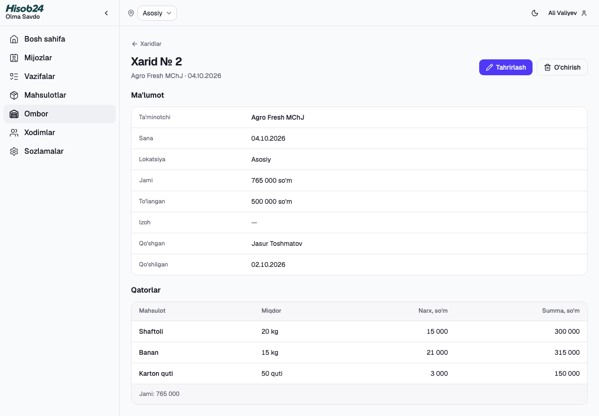</td>
</tr>
</table>

### 7.18. Xarid formasi

`/purchases/new` («Yangi xarid»), `/purchases/[id]/edit` («Xaridni tahrirlash»).

- **Sarlavha** izohida lokatsiya («Asosiy»). Tahrirda xarid raqami va lokatsiya («№ 2 · Asosiy»); lokatsiya o'zgarmaydi.
- **«Ta'minotchi».** Nom bo'yicha qidirib tanlanadigan combobox («Nom bo'yicha qidiring»), faqat faollar. Tanlangani «×» bilan bo'shatiladi.
- **«Sana».** Standart bugun; o'tgan va kelgusi sana ham mumkin.
- **«Mahsulotlar».** Qatorlar ro'yxati va «Qator qo'shish». Har qator:
  - «Mahsulot» combobox («Nom yoki artikul»): taklifda birlik va oxirgi narx;
  - «Miqdor»: o'ngida birlik;
  - «Narx»: mahsulot tanlanganda oxirgi xarid narxi tushadi;
  - «Summa»: hisoblanadi;
  - qatorni olib tashlash «×».
  - Desktop'da qator bitta satr, telefonda maydonlar ustma-ust.
- **«Jami {N} so'm».**
- **«To'langan».** Standart bo'sh (0); «To'liq» tugmasi jamini tushiradi.
- **«Izoh»** va «Saqlash».
- **Qoidalar.** Bir mahsulot bir xaridda bir marta. Miqdor > 0 (3 kasr xonagacha), narx ≥ 0. Vergul ham qabul qilinadi.

<table>
<tr><th>Yangi, telefon</th><th>Tahrir, telefon</th></tr>
<tr>
<td valign="top">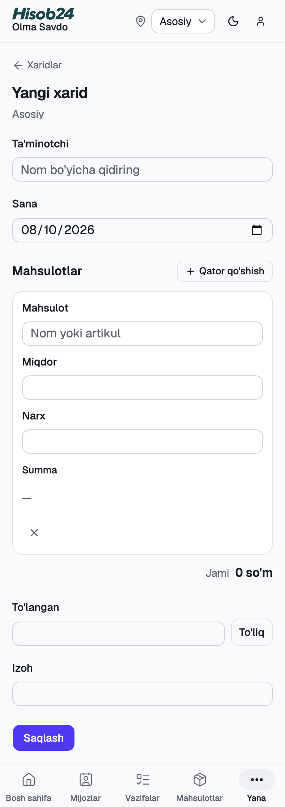</td>
<td valign="top">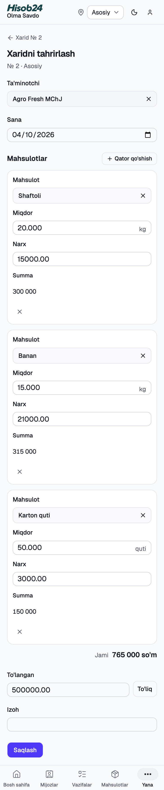</td>
</tr>
</table>

<table>
<tr><th>Yangi, desktop</th><th>Tahrir, desktop</th></tr>
<tr>
<td valign="top">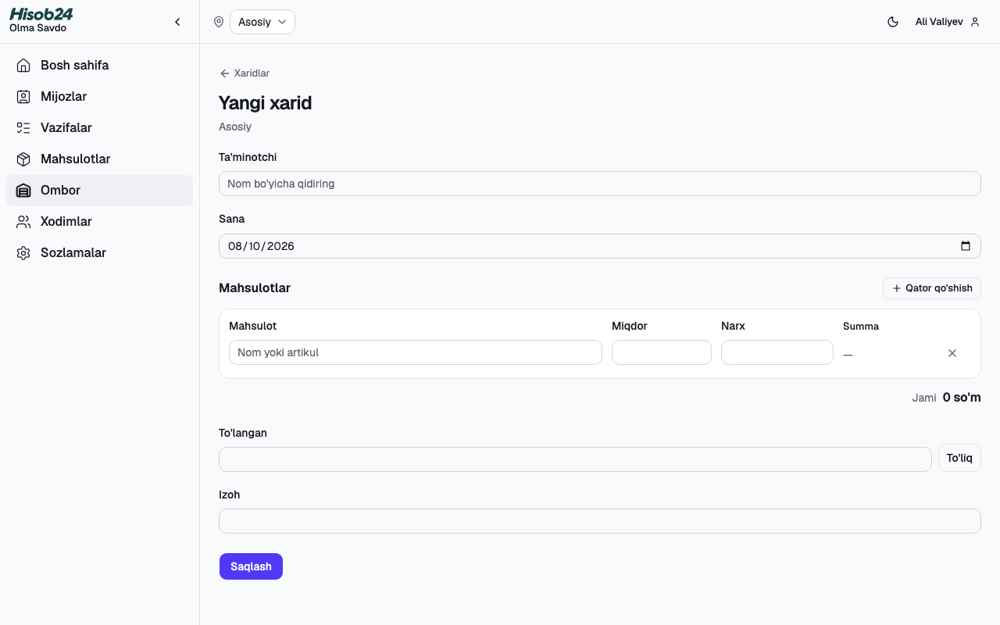</td>
<td valign="top">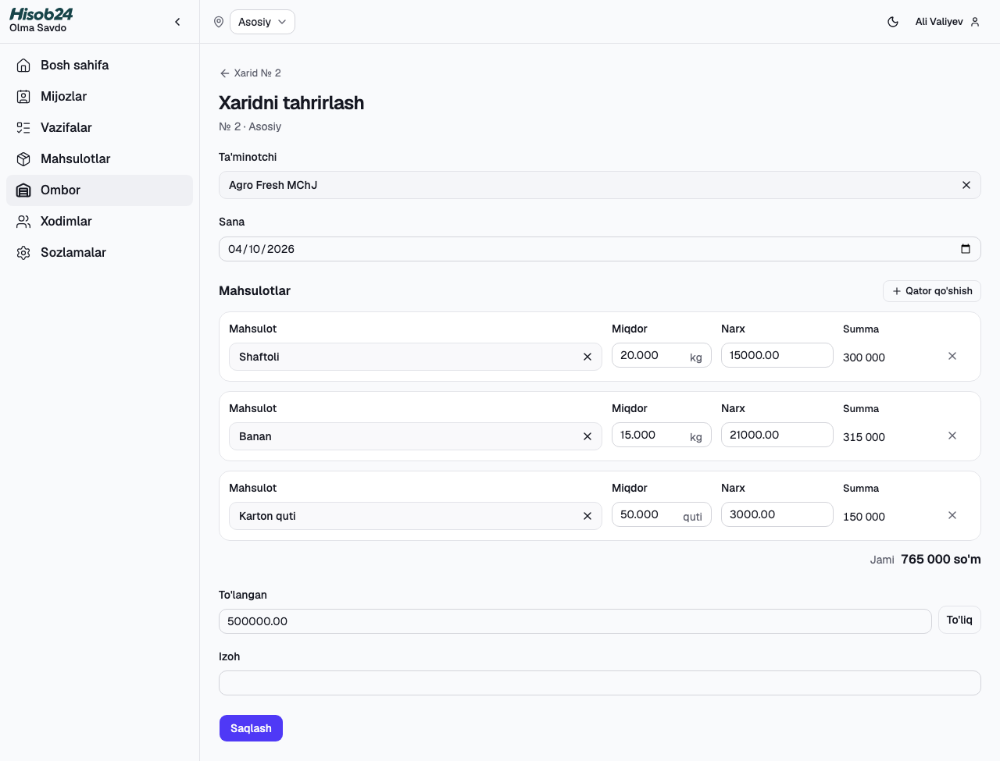</td>
</tr>
</table>

### 7.19. Ta'minotchilar

`/suppliers` · Ta'minotchilar «Ko'rish».

- **Sarlavha.** «Ta'minotchilar», «Kompaniyangiz ta'minotchilari · N ta», «Ta'minotchi qo'shish».
- **Asboblar.** «Faol | Nofaol», qidiruv «Nom yoki telefon».
- **Jadval ustunlari:**
  - «Ta'minotchi», «Telefon»;
  - «Qarz» (Xaridlar «Ko'rish» bilan): qarz qizil, avans yashil «Avans 100 000», 0 «—»;
  - «Qo'shgan», «Qo'shilgan».
- **Tartib:** nom bo'yicha.
- **Dialog.** «Ta'minotchi qo'shish», izoh «Nom majburiy; telefon va izoh ixtiyoriy.»

<table>
<tr><th>Telefon</th><th>Desktop</th></tr>
<tr>
<td valign="top">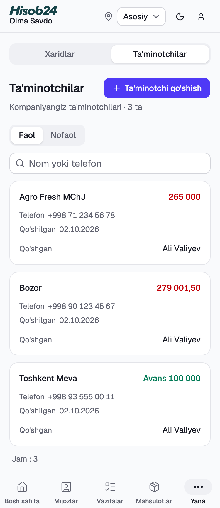</td>
<td valign="top">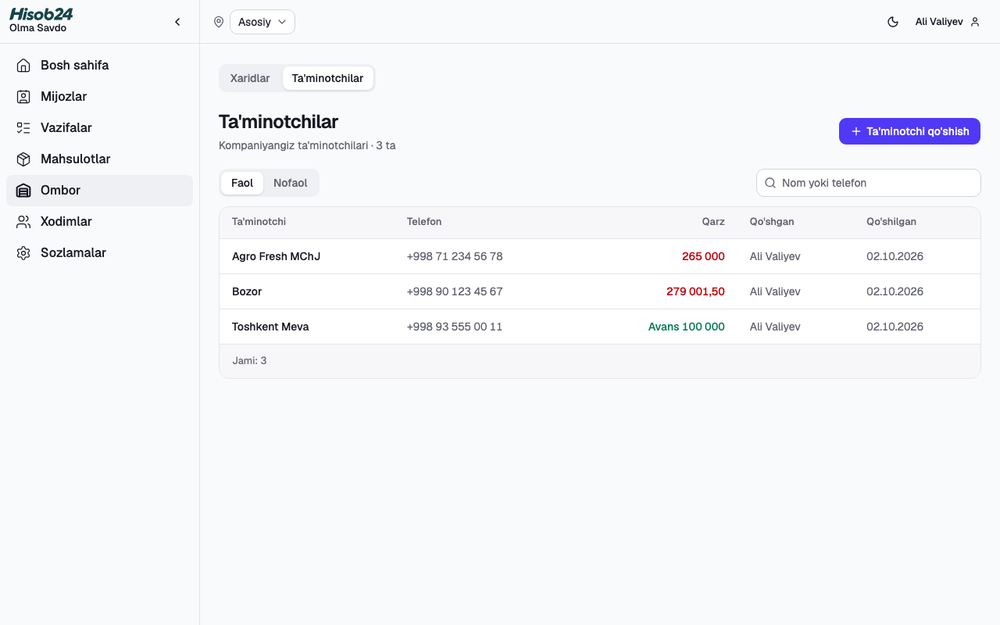</td>
</tr>
</table>

### 7.20. Ta'minotchi sahifasi

`/suppliers/[id]` · Ta'minotchilar «Ko'rish».

- **Sarlavha.** «← Ta'minotchilar»; nom (nofaol bo'lsa belgisi); ostida telefon.
- **Amallar.** «Tahrirlash», «Nofaol qilish» / «Faollashtirish», «O'chirish».
- **Balans kartasi** (Xaridlar «Ko'rish» bilan): «Qarz: 279 001,50 so'm» (qizil), «Avans: N so'm» yoki «Qarz yo'q»; yonida «Jami xaridlar» va «Jami to'lovlar».
- **«Ma'lumot».** Telefon, Izoh, Qo'shgan, Qo'shilgan.
- **«Xaridlar».** «Xarid», «Sana», «Lokatsiya» (2+ lokatsiyada), «Jami, so'm», «To'langan, so'm».
- **«To'lovlar»** va «To'lov qo'shish».
  - Ustunlar: «Sana», «Summa, so'm», «Izoh», «Xarid», «Qo'shgan».
  - O'zi kiritilgan to'lovda tahrirlash va o'chirish ikonkalari bor.
  - Xarid bilan kiritilgan to'lovda «Xarid № N» havolasi bor, amallar yo'q.
- **To'lov dialogi.** «To'lov qo'shish», izoh «Summa va sana majburiy; izoh ixtiyoriy.»; maydonlar «Summa», «Sana», «Izoh».
- **O'chirish.** Xaridi yoki to'lovi bor ta'minotchi o'chirilmaydi: toast «Bu ta'minotchida N ta xarid bor». Uni nofaol qilish mumkin.

<table>
<tr><th>Telefon</th><th>To'lov qo'shish</th><th>Desktop</th></tr>
<tr>
<td valign="top">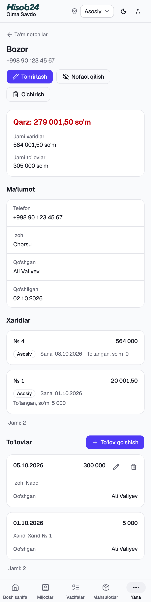</td>
<td valign="top">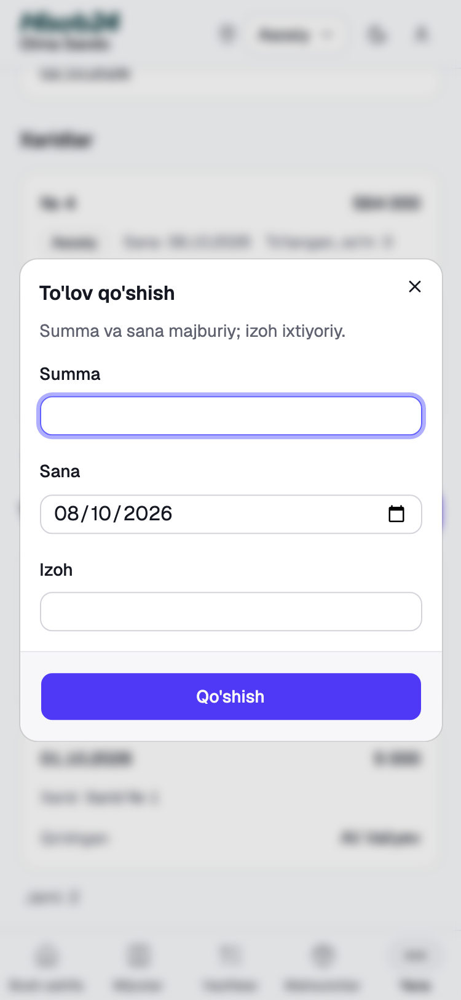</td>
<td valign="top">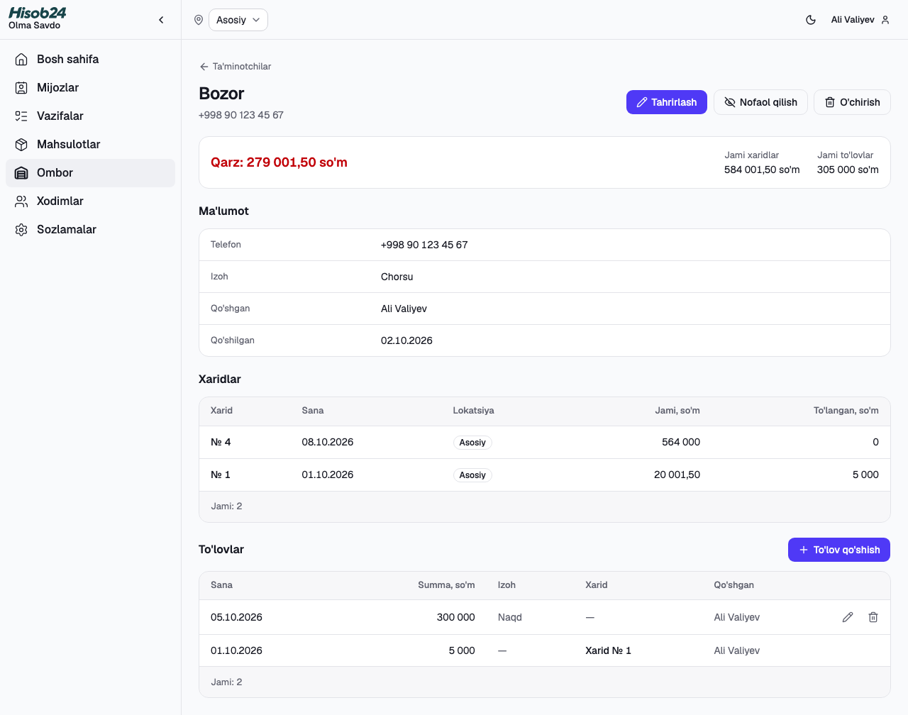</td>
</tr>
</table>

### 7.21. Xodimlar

`/employees` · Xodimlar «Ko'rish».

- **Sarlavha.** «Xodimlar», «Kompaniyangiz a'zolari · N kishi», «Xodim qo'shish».
- **Jadval ustunlari:**
  - «A'zo»: avatar, ism, telefon; o'z qatorida «Siz»;
  - «Rol»: «Egasi» indigo nuqta bilan, rol nomi yoki «Xodim»;
  - «Lokatsiyalar» (kompaniyada 2+ lokatsiya bo'lsa): «Barchasi», nomlar yoki «—»;
  - «Qo'shilgan» (768–1023 px da yashirin).
- **Qator amallari** (ikonkalar, tooltip bilan), faqat xodim qatorlarida:
  - rol (qalqon) va lokatsiyalar (pin) — faqat egasiga;
  - «Ismni o'zgartirish» (qalam) va «O'chirish» (savat) — ruxsat bo'yicha.
- **Tartib.** Egasi birinchi turadi; uning qatorida amal yo'q.
- **Dialoglar:**
  - «Xodim qo'shish»: «Telefon raqami», «Ism»; izoh «Xodim shu raqam bilan tizimga kiradi: SMS kod yoki Telegram bot orqali.»;
  - «Ismni o'zgartirish»;
  - «Rolni o'zgartirish»: «Rol» select, «Rolsiz» varianti bilan; izoh «Rolsiz xodim mijozlar va vazifalar bilan ishlaydi.»;
  - «Lokatsiyalarni o'zgartirish»: «Barcha lokatsiyalar» checkbox yoki lokatsiyalar ro'yxati; izoh «Xodim faqat belgilangan lokatsiyalarning vazifalarini ko'radi va qo'shadi.»;
  - tasdiq «Xodimni o'chirasizmi?».

<table>
<tr><th>Telefon</th><th>Xodim qo'shish</th></tr>
<tr>
<td valign="top">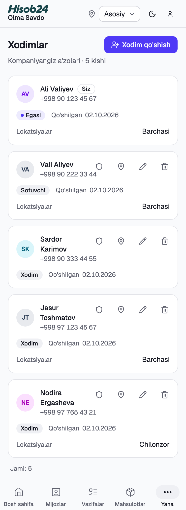</td>
<td valign="top">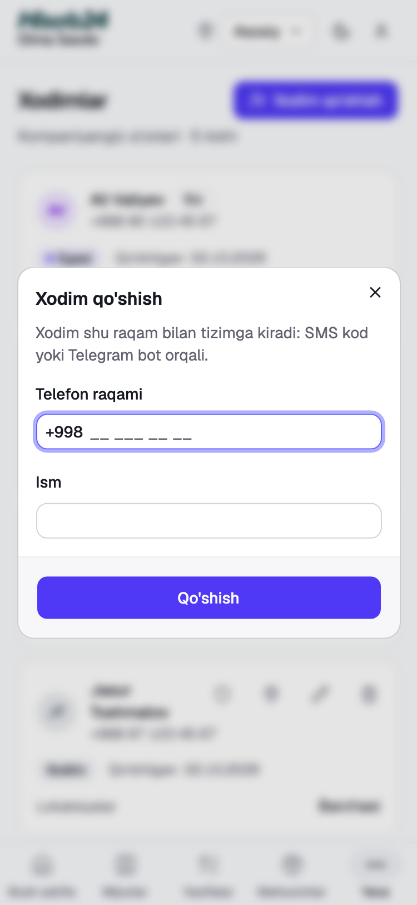</td>
</tr>
</table>

<table>
<tr><th>Desktop</th></tr>
<tr><td valign="top">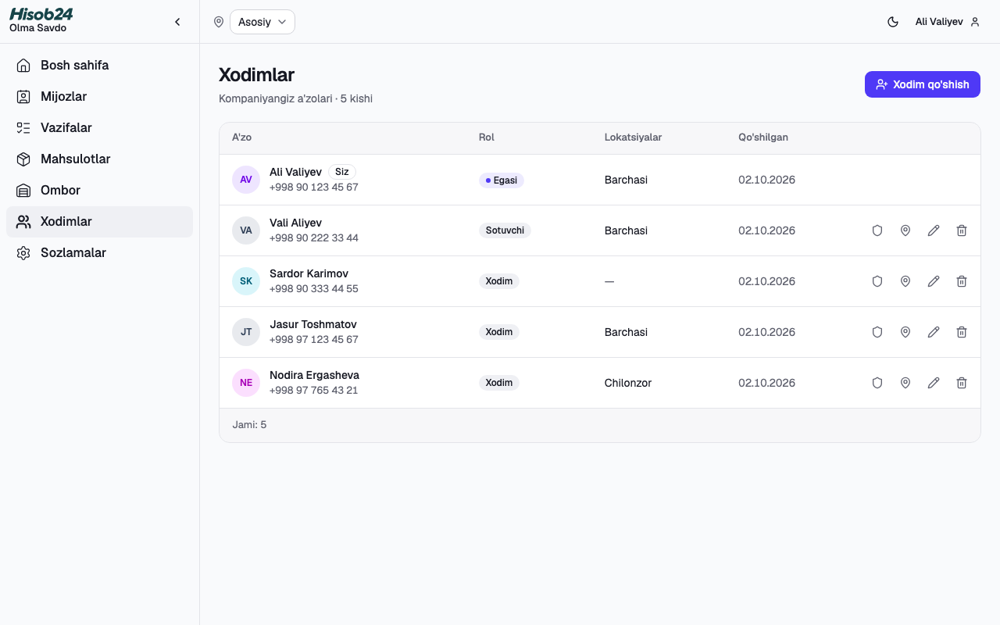</td></tr>
</table>

<table>
<tr><th>Rolni o'zgartirish</th><th>Lokatsiyalarni o'zgartirish</th></tr>
<tr>
<td valign="top">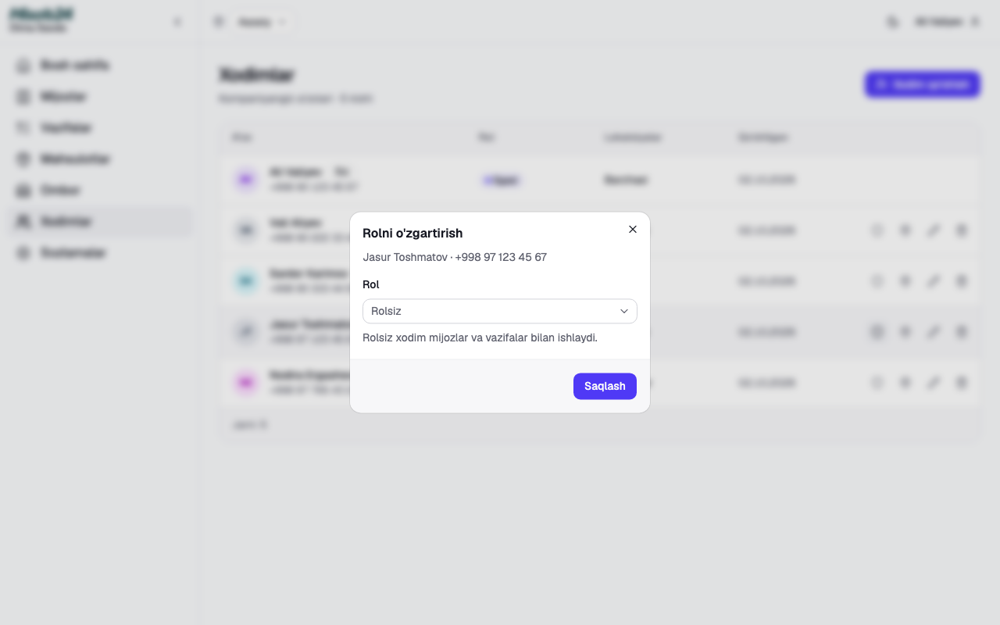</td>
<td valign="top">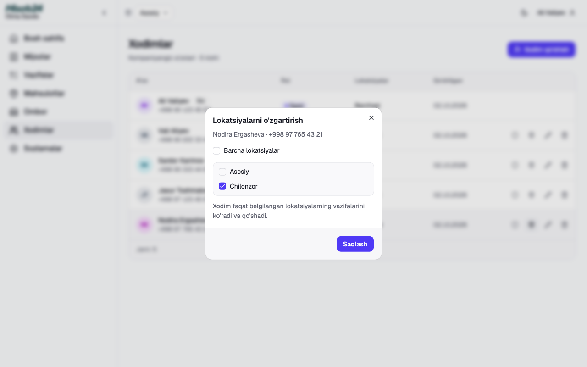</td>
</tr>
</table>

### 7.22. Sozlamalar

`/settings` · Sozlamalar «Ko'rish». Sarlavha «Sozlamalar», izoh «Mijozlar va vazifalar sozlamalari». Ostida tablar; tab manzilda (`?tab=`).

| Tab | Bo'limlar | Qator tarkibi |
|---|---|---|
| Mijozlar | «Mijoz turlari» | sudrash tutqichi, nom (tur sahifasiga havola), ostida maydonlari; nomni o'zgartirish, o'chirish |
| Vazifalar | «Vazifa turlari», «Bosqichlar» | tur: nom va maydonlari; bosqich: rang nuqtasi, nom, «Yakuniy» belgisi |
| Dropdownlar | «Dropdownlar» | nom (sahifaga havola), ostida variantlari |
| Rollar (faqat egasi) | «Rollar» | nom (rol sahifasiga havola), ostida bo'limlari va «N ta xodim» yoki «Hech kimda» |

- **Har bo'limda** sarlavha, izoh va qo'shish tugmasi: «Tur qo'shish», «Vazifa turi qo'shish», «Bosqich qo'shish», «Dropdown qo'shish», «Rol qo'shish».
- **Tartib** sudrab o'zgartiriladi (tutqich, sichqoncha, barmoq yoki klaviatura strelkalari).
- **Nom dialogi** (tur, vazifa turi, dropdown): bitta «Nomi» maydoni va izoh («Masalan: Jismoniy, Yuridik. Maydonlari tur sahifasida qo'shiladi.»).
- **Bosqich dialogi:**
  - «Nomi»;
  - «Rangi»: 9 ta rang doirasi;
  - «Yakuniy bosqich» checkbox, izohi «Bu bosqichdagi vazifa bajarilgan hisoblanadi: muddati o'tgan deb belgilanmaydi.»
- **O'chirish rad javoblari** toast'da: «Bu turda N ta mijoz bor», «Bu bosqichda N ta vazifa bor», «Bu rol N ta xodimga biriktirilgan» va h.k.

<table>
<tr><th>Mijozlar</th><th>Vazifalar</th><th>Dropdownlar</th><th>Rollar</th></tr>
<tr>
<td valign="top">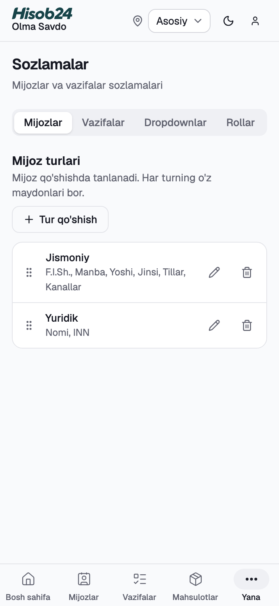</td>
<td valign="top">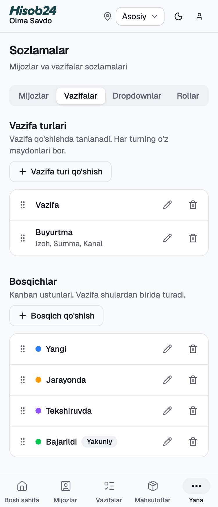</td>
<td valign="top">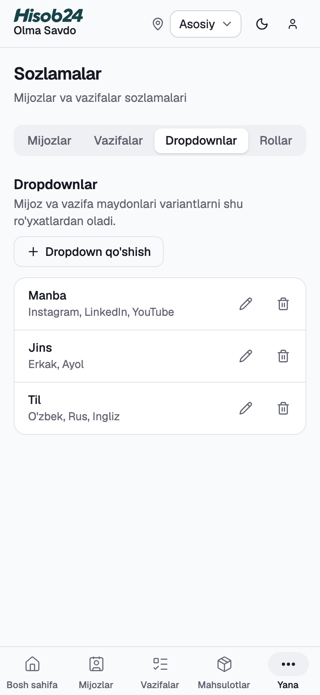</td>
<td valign="top">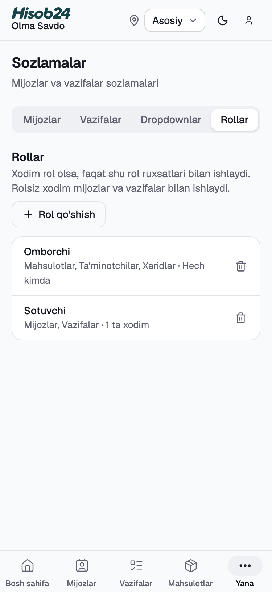</td>
</tr>
</table>

<table>
<tr><th>Bosqich qo'shish</th><th>Desktop: Vazifalar tabi</th></tr>
<tr>
<td valign="top">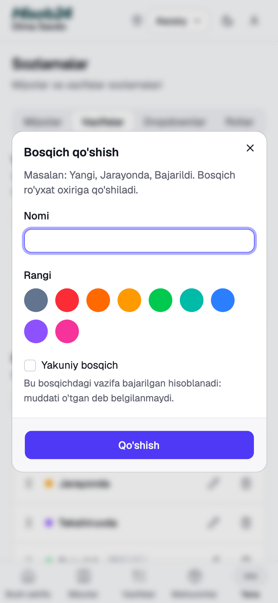</td>
<td valign="top">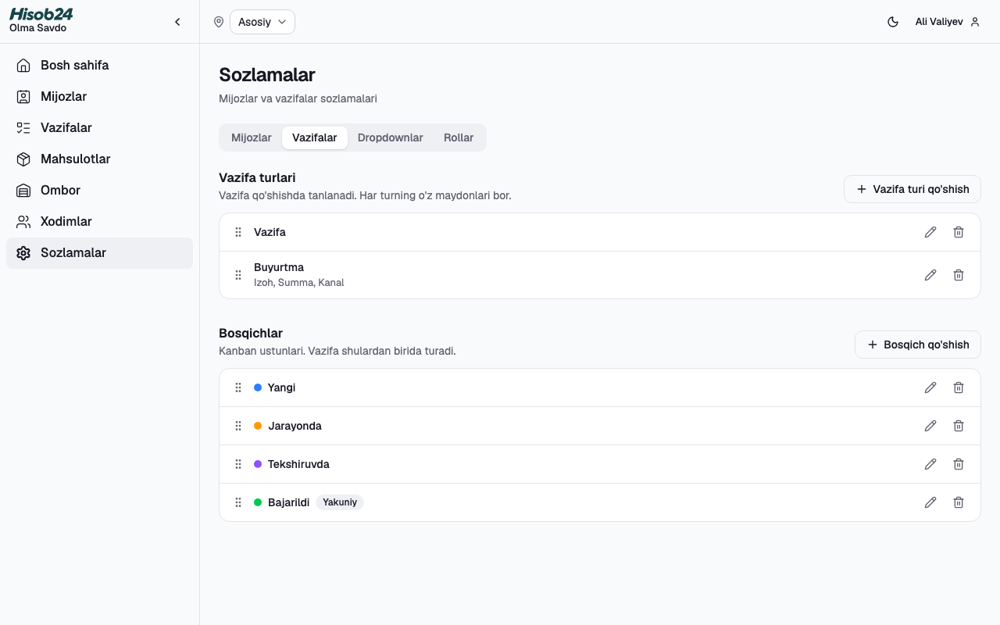</td>
</tr>
</table>

Qolgan desktop tablari: [Mijozlar](screens/70-settings-customers-desktop.png), [Dropdownlar](screens/72-settings-dropdowns-desktop.png), [Rollar](screens/73-settings-roles-desktop.png).

### 7.23. Mijoz turi va vazifa turi

`/settings/customer-types/[id]`, `/settings/task-types/[id]` · Sozlamalar «Ko'rish».

- **Sarlavha.** «← Sozlamalar»; tur nomi; izoh «Mijoz turi · N ta maydon» yoki «Vazifa turi · N ta maydon»; «Maydon qo'shish».
- **Maydonlar ro'yxati** (sudraladi). Qatorda:
  - nom va belgilar: «Majburiy»; «Takrorlanmas» (faqat mijoz maydonida); turning birinchi matn maydonida «Mijoz nomi»;
  - ostida maydon turi va dropdowni («Checkbox (bir nechta tanlov) · Manba»);
  - tahrirlash va o'chirish.
- **Izoh:**
  - mijoz turida: telefon har mijozda bor;
  - vazifa turida: «Nomi, muddat va mijoz har vazifada bor va majburiy, mas'ul ixtiyoriy: ularni maydon qilib qo'shish shart emas.»
- **Maydon dialogi** («Maydon qo'shish» / «Maydonni tahrirlash»):
  - «Nomi»;
  - «Turi» (6 tur; yaratilgandan keyin o'zgarmaydi);
  - tanlov turlarida «Dropdown» («Tanlang»);
  - «Majburiy»;
  - matn va son maydonida «Takrorlanmasin» (faqat mijoz turida).

<table>
<tr><th>Mijoz turi, telefon</th><th>Maydon qo'shish</th><th>Mijoz turi, desktop</th></tr>
<tr>
<td valign="top">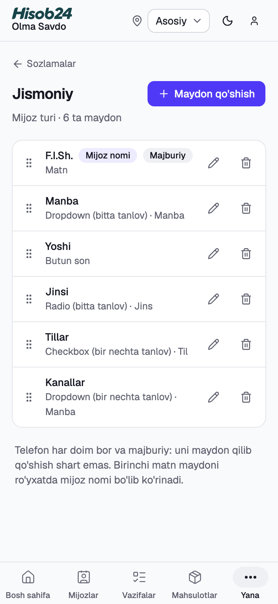</td>
<td valign="top">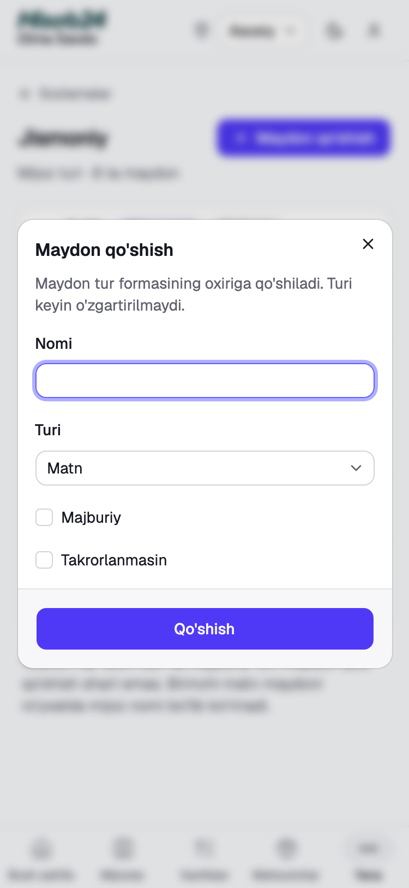</td>
<td valign="top">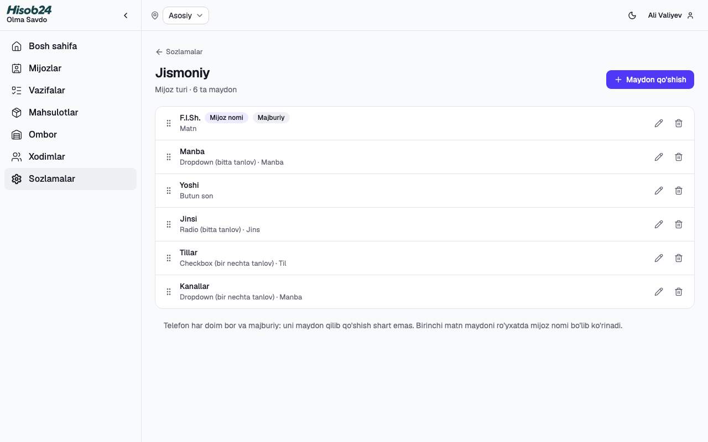</td>
</tr>
</table>

<table>
<tr><th>Vazifa turi, telefon</th><th>Vazifa turi, desktop</th></tr>
<tr>
<td valign="top">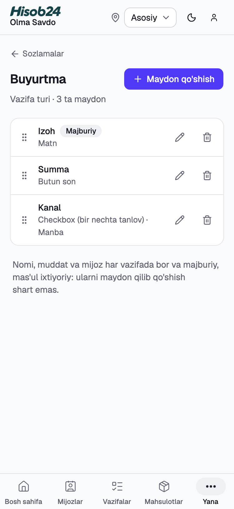</td>
<td valign="top">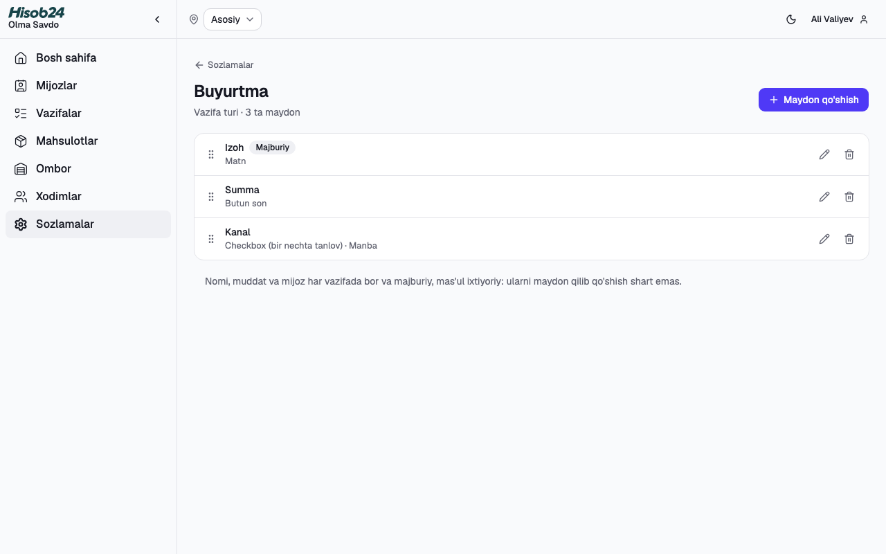</td>
</tr>
</table>

### 7.24. Dropdown sahifasi

`/settings/dropdowns/[id]` · Sozlamalar «Ko'rish».

- **Sarlavha.** «← Sozlamalar»; dropdown nomi; izoh «Dropdown · N ta variant».
- **Variantlar ro'yxati** (sudraladi). Har variantda:
  - nomni o'zgartirish;
  - nofaol qilish / faollashtirish: nofaol variant xira, yangi tanlovlarda chiqmaydi, eski yozuvlarda qoladi;
  - o'chirish.
- **Ro'yxat ostida** tez qo'shish satri: yozib Enter bosiladi.
- **Bo'sh:** «Hali variant yo'q» / «Pastdagi satrga yozib, Enter bosing.»

<table>
<tr><th>Telefon</th><th>Desktop</th></tr>
<tr>
<td valign="top">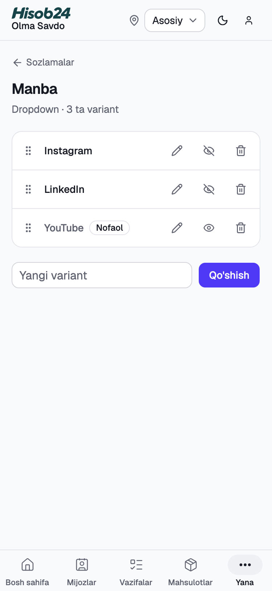</td>
<td valign="top">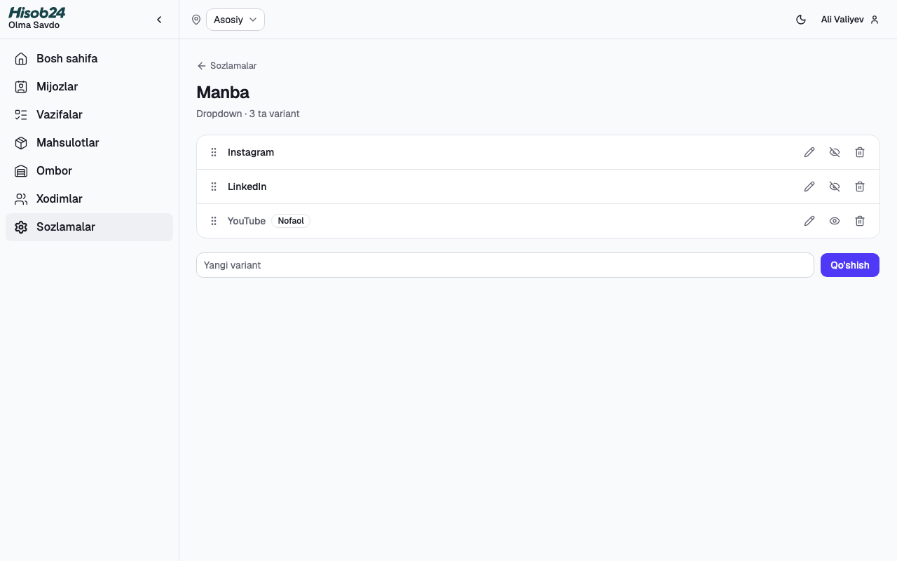</td>
</tr>
</table>

### 7.25. Rol sahifasi

`/settings/roles/new` («Yangi rol»), `/settings/roles/[id]` · faqat egasi.

- **Sarlavha.** «← Sozlamalar»; rol nomi; izoh «Rol · N ta xodim»; o'chirish ikonkasi.
- **«Rol nomi».**
- **Ruxsat matritsasi:**
  - 768 px dan jadval: qatorlarda 7 bo'lim, ustunlarda «Ko'rish», «Qo'shish», «Tahrirlash», «O'chirish», «Tarix». Tarix faqat Mijozlar va Vazifalarda, qolganida katak bo'sh;
  - telefonda har bo'lim alohida checkbox guruhi.
- **Qoidalar.** Amal belgilansa «Ko'rish» o'zi belgilanadi. «Ko'rish» olib tashlansa, bo'lim tozalanadi.
- **«Saqlash».** Toast «Rol yaratildi» / «Rol saqlandi», keyin Rollar tabiga qaytadi.
- **O'chirish.** Xodimga biriktirilgan rol o'chirilmaydi: «Bu rol N ta xodimga biriktirilgan».

<table>
<tr><th>Telefon</th><th>Desktop</th></tr>
<tr>
<td valign="top">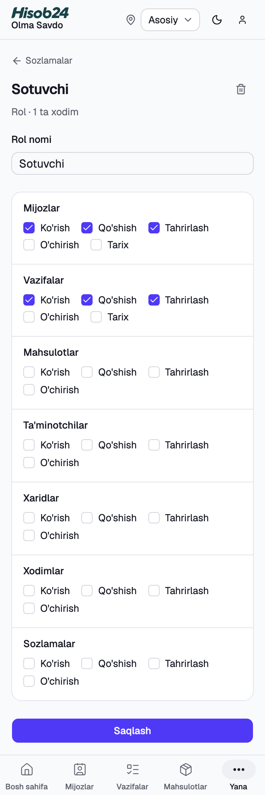</td>
<td valign="top">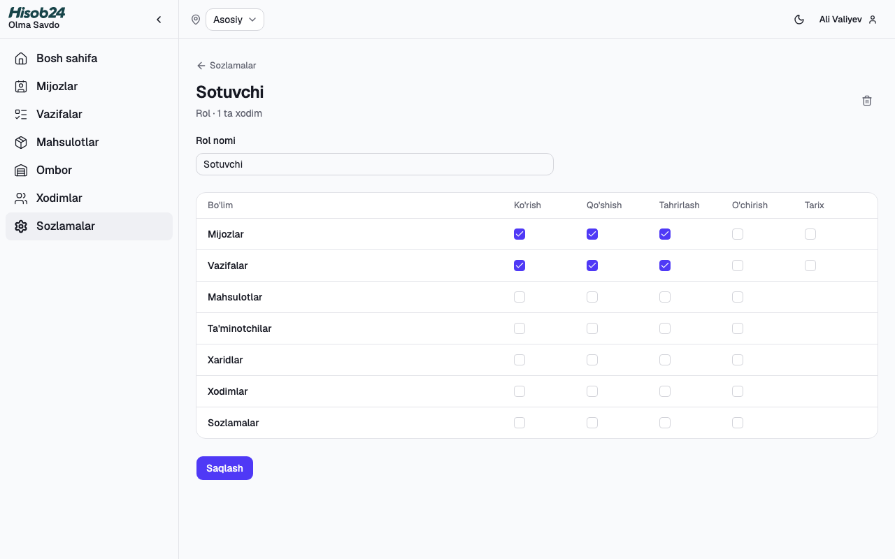</td>
</tr>
</table>

## 8. Ma'lumotlar va maydonlar

Formalar va jadvallar uchun: har obyektning maydonlari, cheklovlari va qayerda ko'rinishi.

### 8.1. Mijoz

| Maydon | Majburiy | Qoida | Qayerda ko'rinadi |
|---|---|---|---|
| Telefon | ha | faqat +998 va 9 raqam; faol mijozlar ichida takrorlanmaydi | ro'yxat (nom ostida), sahifa, vazifa |
| Turi | ha | tanlanadi, keyin o'zgarmaydi | ro'yxat, sahifa izohi |
| Turning maydonlari | sozlamaga qarab | 8.2-bo'lim | ro'yxat ustunlari, sahifa «Ma'lumot» |
| Qo'shgan, Qo'shilgan | avtomatik | a'zoning hozirgi ismi; sana | ro'yxat, sahifa |

Mijoz nomi alohida maydon emas: turning birinchi matn maydoni (Jismoniyda «F.I.Sh.», Yuridikda «Nomi») nom hisoblanadi. U bo'sh bo'lsa, mijoz telefoni bilan ataladi. Har kompaniya ikki tayyor tur bilan boshlaydi:

- Jismoniy: «F.I.Sh.»;
- Yuridik: «Nomi», «INN» (takrorlanmas).

### 8.2. Maydon turlari (mijoz va vazifa turlarida)

| Tur | Interfeysda | Formada | Cheklov |
|---|---|---|---|
| `string` | Matn | matn maydoni | 500 belgigacha |
| `int` | Butun son | raqamli maydon | butun son |
| `dropdown` | Dropdown (bitta tanlov) | select, «Tanlanmagan» bilan | bitta variant |
| `multi_dropdown` | Dropdown (bir nechta tanlov) | ko'p tanlovli select | bir nechta variant |
| `radio` | Radio (bitta tanlov) | radio guruh | bitta variant |
| `checkbox` | Checkbox (bir nechta tanlov) | checkbox guruh | bir nechta variant |

- Maydon belgilari:
  - «Majburiy»;
  - «Takrorlanmasin»: faqat mijoz turida, matn va son maydonida.
- Tanlov maydonlari variantlarni «Dropdown»dan oladi. Dropdownlar mijoz va vazifa maydonlari uchun umumiy.
- Nom: 60 belgigacha. Tur nomi kompaniyada, maydon nomi tur ichida, variant nomi dropdown ichida takrorlanmaydi.

### 8.3. Vazifa

| Maydon | Majburiy | Qoida |
|---|---|---|
| Nomi | ha | 200 belgigacha |
| Muddat | ha | faqat sana, vaqtsiz; o'tgan sana ham mumkin |
| Mijoz | ha | mavjud yoki yangi mijoz; keyin o'zgarmaydi |
| Bosqich | ha | kompaniyaning bosqichi |
| Turi | ha | keyin o'zgarmaydi |
| Lokatsiya | avtomatik | joriy lokatsiya; formada yo'q, keyin o'zgarmaydi |
| Mas'ul | yo'q | shu lokatsiyada ishlaydigan a'zo |
| Turning maydonlari | sozlamaga qarab | 8.2-bo'lim |

Muddat ko'rinishi:

- sana va nisbiy matn: «Bugun», «3 kun qoldi», «2 kun kechikdi»;
- kechikkan va yakuniy bo'lmagan vazifa qizil;
- yakuniy bosqichda faqat sana.

### 8.4. Bosqich

- **Nom:** 60 belgigacha.
- **Rang:** 9 tadan biri. Kulrang, Qizil, To'q sariq, Sariq, Yashil, Moviy, Ko'k, Binafsha, Pushti.
- **«Yakuniy» belgisi:** shu bosqichdagi vazifa bajarilgan hisoblanadi.
- **Tartib** egasiniki. Tayyor bosqichlar: Yangi (ko'k), Jarayonda (sariq), Bajarildi (yashil, yakuniy).

### 8.5. Mahsulot va xizmat

| Maydon | Mahsulot | Xizmat | Qoida |
|---|---|---|---|
| Nomi | majburiy | majburiy | 1–120 belgi, takrorlanmaydi |
| Birlik | majburiy | yo'q | dona, kg, g, l, ml, m, m², quti, juft, komplekt |
| Narx | ixtiyoriy | ixtiyoriy | so'm, 2 kasr xonagacha; mahsulotda sotuv narxi |
| Artikul | ixtiyoriy | yo'q | 60 belgigacha, takrorlanmaydi |
| Izoh | ixtiyoriy | ixtiyoriy | 500 belgigacha |
| Holat | — | — | Faol / Nofaol |

Hisoblanadigan qiymatlar (faqat mahsulotda):

- **qoldiq:** lokatsiya bo'yicha, faqat xaridlar bilan o'zgaradi;
- **oxirgi xarid narxi:** mahsulot sahifasida ko'rinadi va xarid formasiga tushadi.

### 8.6. Ta'minotchi, xarid, to'lov

| Obyekt | Maydonlar |
|---|---|
| Ta'minotchi | Nomi (majburiy, 120 belgi, takrorlanmaydi), Telefon (ixtiyoriy, +998), Izoh (500), Holat (Faol / Nofaol), Balans (hisoblanadi) |
| Xarid | Raqam (№, avtomatik, kompaniyada ketma-ket), Lokatsiya (joriy), Ta'minotchi, Sana, Qatorlar (kamida bitta), To'langan, Izoh, Jami (hisoblanadi) |
| Xarid qatori | Mahsulot (faqat mahsulot, xizmat emas), Miqdor (> 0, 3 kasr), Narx (≥ 0, 2 kasr), Summa (hisoblanadi) |
| To'lov | Summa (> 0), Sana, Izoh; xarid bilan kiritilgani xaridga bog'langan |

Balans = xaridlar jami − to'lovlar jami (hamma lokatsiya bo'yicha). Musbat bo'lsa «Qarz», manfiy bo'lsa «Avans», nol bo'lsa «Qarz yo'q».

### 8.7. Xodim, rol, lokatsiya

| Obyekt | Maydonlar |
|---|---|
| Xodim | Telefon (o'zgarmaydi), Ism (shu kompaniyadagi), Rol (Egasi / rolsiz / kompaniya roli), Lokatsiyalar (hammasi yoki tanlanganlari), Qo'shilgan |
| Rol | Nomi (1–60, takrorlanmaydi), Ruxsatlar (matritsa), nechta xodimda |
| Lokatsiya | Nomi (admin beradi); user app'da faqat tanlanadi va ko'rinadi |

## 9. Telegram: Mini App va botlar

### 9.1. Mini App

User app Telegram ichida ham o'sha ilova; alohida ilova emas. Farqlari:

| Nima | Brauzerda | Telegram ichida |
|---|---|---|
| Kirish | SMS kod | avtomatik ([5.2](#52-telegram-orqali-kirish-mini-app)) |
| Ranglar | light / dark (tizim sozlamasi yoki mavzu tugmasi) | chat mavzusining ranglari ([10.2](#102-ranglar)) |
| Mavzu tugmasi | bor | yo'q |
| «Chiqish» | profil menyusida | yo'q (Mini App'ni yopish chiqish) |
| Ekran | brauzer oynasi | telefonda to'liq ekran (Bot API 8.0+); desktop Telegram'da sarlavha ostida |
| Navigatsiya | kenglikka qarab sidebar yoki tab-bar | odatda telefon: tab-bar |

- **To'liq ekran.** Telefonda Telegram sarlavhasi yo'qoladi va app butun ekranni oladi. Tepada status bar va Telegram'ning suzuvchi tugmalari (yopish, «⋯») app ustida turadi. App bu joyni bo'sh qoldiradi: topbar, login paneli, holat ekranlari va toastlar shu chetdan pastroqdan boshlanadi. Skrinshotdagi soxta Telegram'da bu 93 px.
- **Pastki chet.** Tab-bar telefonning pastki xavfsiz zonasini hisobga oladi.
- **Sudrash.** Telegram'ning pastga tortib yopish harakati o'chirilgan, aks holda kanban kartasini sudrash Mini App'ni yopardi.
- **Telegram tugmalari.** BackButton va MainButton ishlatilmaydi: sahifalarda o'z «orqaga» havolalari va tugmalari bor.

### 9.2. User bot

Kompaniya a'zolari uchun. Vazifasi: Telegram akkauntni telefon raqamiga bog'lash va Mini App'ni ochish.

| Holat | Bot javobi | Klaviatura |
|---|---|---|
| `/start` yoki istalgan matn | «Assalomu alaykum! Hisob24 akkauntingizni ulash uchun telefon raqamingizni yuboring.» | «📱 Raqamni yuborish» (raqam so'raydigan tugma) |
| O'z raqami yuborildi, raqam tizimda bor | «✅ Akkauntingiz ulandi» | olib tashlanadi |
| O'z raqami yuborildi, raqam tizimda yo'q | «Raqamingiz saqlandi» | olib tashlanadi |
| Boshqa odamning kontakti yuborildi | «Iltimos, o'z raqamingizni yuboring» | «📱 Raqamni yuborish» |
| Ichki xato | «Xatolik yuz berdi. Birozdan keyin qayta urinib ko'ring.» | «📱 Raqamni yuborish» |

- **Menyu tugmasi** (chat pastidagi): «Hisob24», Mini App'ni ochadi.
- **Buyruqlar menyusi** (BotFather'da, ixtiyoriy): `start — Raqamni ulash`.
- **Xabarnoma yuborilmaydi.** Bot vazifa, muddat yoki boshqa voqea haqida xabar yubormaydi: hozircha bunday funksiya yo'q.

### 9.3. Admin bot (qisqacha)

Platforma adminlari uchun; admin panel bu hujjatga kirmaydi.

- **`/login`.** Bot «Kod: 123456 (1 daqiqa amal qiladi)» yuboradi. Kod bosilganda nusxalanadi.
- **Admin bo'lmagan odamga:** «Sizda ruxsat yo'q.» va uning Telegram ID'si.
- **Admin boshqa matn yozsa:** «Admin panelga kirish uchun /login yozing.»
- **Menyu tugmasi:** «Admin panel», admin panelni Mini App bo'lib ochadi.

Bot profili BotFather'da sozlanadi (rasm, tavsif, «About» matni). Agar dizayner bot avatari yoki tavsifini taklif qilsa, ular kod o'zgarishisiz qo'yiladi.

## 10. Dizayn tizimi (hozirgi holat)

Hozirgi ko'rinish shadcn/ui (Base UI asosida, «base-nova» uslubi) va Tailwind v4 ustiga qurilgan. Pastdagi qiymatlar `apps/web/app/globals.css` dan; HEX qiymatlar OKLCH'dan taxminiy hisoblangan.

### 10.1. Tamoyillar («hisob daftari»)

- **Yagona urg'u.** Har ekranda bitta to'liq rangli (indigo) tugma: asosiy amal. Indigo yana faqat «Egasi» belgisida va fokus halqasida.
- **Qator boshida shaxs.** Avatar (bosh harflar), ism (500 vazn) va xira ikkinchi qator. Doira: odam; kvadrat: kompaniya.
- **Raqamlar tekis.** Sana, telefon, summa `tabular-nums`; summalar o'ngga tekislangan.
- **Tuzilma ma'lumot beradi.** Ro'yxatga bitta ramka, qatorlar orasida ingichka chiziq, footer ramka ichida. Soya faqat suzuvchi qatlamda (dialog, menyu).
- **Ataylab yo'q:**
  - BOSH HARFLI yorliqlar;
  - bir xil soyali kartochkalar to'plami;
  - gradient;
  - bezak ikonkalar;
  - KPI plitkalar;
  - kirishdagi animatsiya;
  - monospace.
- **Harakat faqat amalga javob.** Dialog ochilishi, qadam almashishi. `prefers-reduced-motion` da hammasi o'chadi.
- **Kenglik.** Mazmun kontent maydonining to'liq enida, o'rtaga siqilmaydi. Bu loyiha egasining aniq qarori: markazdagi tor ustun varianti rad etilgan.

### 10.2. Ranglar

| Token | Vazifasi | Light | Dark | Telegram ichida |
|---|---|---|---|---|
| `--background` | sahifa foni | `#f9fafc` | `#0b0c10` | `bg_color` |
| `--foreground` | asosiy matn | `#161822` | `#fafafb` | `text_color` |
| `--card` | kartochka, ro'yxat ramkasi, dialog | `#ffffff` | `#16171c` | `section_bg_color` |
| `--primary` | asosiy tugma, havola urg'usi (indigo) | `#4f39f6` | `#7c86ff` | `button_color` |
| `--primary-foreground` | asosiy tugma matni | `#fafafa` | `#171717` | `button_text_color` |
| `--muted`, `--secondary`, `--accent` | yumshoq fon: tab, tasma, hover | `#eff0f4` | `#25262c` | `secondary_bg_color` |
| `--muted-foreground` | xira matn | `#60626f` | `#a0a2ad` | `hint_color` |
| `--destructive` | xato, qarz, o'chirish, kechikkan muddat | `#c10007` | `#ff6467` | `destructive_text_color` |
| `--border` | chegara, ajratuvchi chiziq | `#e3e4e9` | oq 10 % | light / dark qiymati |
| `--input` | maydon chegarasi | `#d3d4da` | oq 15 % | light / dark qiymati |
| `--ring` | fokus halqasi | `#615fff` | `#7c86ff` | `button_color` |
| `--sidebar` | sidebar va tab-bar foni | `#f9fafc` | `#16171c` | `secondary_bg_color` |
| `--sidebar-accent` | joriy bo'lim plashkasi | `#eff0f4` | `#25262c` | `bg_color` |
| `--brand` | logotip | `#174449` | `#ffffff` | `text_color` |
| `--brand-panel` | login paneli | `#174449` | `#174449` | `secondary_bg_color` |
| `--brand-panel-foreground` | panel ustidagi matn va logotip | `#ffffff` | `#ffffff` | `text_color` |

Qo'shimcha ranglar (Tailwind palitrasidan):

- **Bosqich ranglari.** Nuqta: 500 tus. Belgi: 500 tusning 10 % foni va 800 tus matn (dark'da 300).
- **Avatar tuslari** (5 ta): sky, cyan, violet, fuchsia, slate; 15 % fon. Holat ranglari (yashil, sariq, qizil) va indigo avatarga berilmaydi: avatar rangi holat deb o'qilmasin.
- **Pul holati.** Qarz qizil (`--destructive`); avans yashil; nol «—».
- **Holat belgilari.** «Muddati o'tgan» qizil yumshoq fonda; «Bloklangan», «Nofaol», «Xodim» neytral; «Egasi» `--primary` 10 % fon va indigo nuqta.

Kontrast (WCAG, hisoblangan):

| Juftlik | Light | Dark |
|---|---|---|
| asosiy tugma matni | 6.2 : 1 | 5.7 : 1 |
| matn sahifada / kartochkada | 17.0 / 17.8 | 18.7 / 17.2 |
| xira matn sahifada / kartochkada | 5.8 / 6.0 | 7.7 / 7.1 |
| logotip `#174449` sahifada | 10.3 : 1 | — |

### 10.3. Tipografiya

- **Shrift:** Geist (Google Fonts, lotin). Vaznlar: 400, 500, 600.
- **O'lchamlar:**

| Joy | O'lcham | Vazn |
|---|---|---|
| Sahifa sarlavhasi (`h1`) | 20 px, 768 px dan 24 px | 600 |
| Login qadam sarlavhasi | 24 px | 600 |
| Dialog sarlavhasi | 16 px | 600 |
| Asosiy matn | 14 px | 400 / 500 |
| Ikkinchi qator, izoh, jadval sarlavhasi | 13–14 px, xira | 400 |
| Tab-bar yorlig'i | 11 px | 400 / 500 |
| Kod kataklari (login) | 24 px | 600 |

### 10.4. O'lchamlar va joylashuv

| Narsa | Qiymat |
|---|---|
| Breakpointlar | 640 px (sm), **768 px (md)**: asosiy almashuv, 1024 px (lg): login ikki ustun |
| Sahifa ichki chekkasi | 16 px telefonda, 24 px 768 px dan |
| Topbar | 56 px |
| Sidebar | 256 px, yig'ilganda 64 px |
| Tab-bar | 56 px va pastki xavfsiz zona |
| Radius | asosiy 10 px; shkala 6 / 8 / 10 / 14 / 18 / 22 / 26 px |
| Ro'yxat qatori | ichki chekka 16 × 12 px, balandligi ~65 px |
| Avatar | 36 px |
| Bosiladigan nishon (telefon) | kamida 44 px |
| Login maydoni va tugmasi | 48 px; kod katagi 56 px |
| Kanban ustuni | 288 px (desktop), ekranning ~85 % i (telefon); yig'ilgan 48 px |
| Dialog eni | 384 px (nom, maydon, bosqich, rol, lokatsiya, xodim); 448 px (mijoz, mahsulot, xizmat, ta'minotchi, to'lov); 768 px (vazifa). Telefonda ekran eni minus 32 px |

### 10.5. Ikonkalar va logotip

**Ikonkalar:** [lucide](https://lucide.dev), chiziqli. Navigatsiyada 20 px; joriy bo'limda chiziq qalinligi 2.5, qolganida 1.5.

| Bo'lim | Ikonka |
|---|---|
| Bosh sahifa | `House` |
| Mijozlar | `Contact` |
| Vazifalar | `ListTodo` |
| Mahsulotlar | `Package` |
| Ombor | `Warehouse` |
| Xodimlar | `Users` |
| Sozlamalar | `Settings` |
| «Yana» | `Ellipsis` |

**Logotip:** dizayner tayyorlagan, kodda bor.

- «Hisob24» yozuvi (`Logo`) va «H24» belgisi (`LogoMark`); login fonidagi «24» raqami (`Logo24`).
- Rangi `--brand` tokenidan.
- Tab ikonkasi: `#174449` yumaloq plitka ustida oq «H24».

### 10.6. Komponentlar

| Komponent | Vazifasi |
|---|---|
| `PageHeader` | sahifa sarlavhasi: orqaga havola, `h1`, izoh, amallar |
| `DataList` | ro'yxat: 768 px dan jadval, telefonda kartochkalar; footer «Jami» yoki pager |
| `Identity`, `Avatar` | avatar, ism va ikkinchi qator; butun blok bosiladi |
| `Facts` | «Ma'lumot» bo'limi: «nom — qiymat» qatorlari |
| `RoleBadge` | «Egasi» (indigo nuqta bilan), «Xodim», rol nomi |
| `StageBadge`, `StageDot` | bosqich rangi bilan belgi va nuqta |
| `Deadline` | muddat va nisbiy matn, kechiksa qizil |
| `SectionTabs` | bo'lim ichidagi sahifalar tasmasi (Mahsulotlar / Xizmatlar va h.k.) |
| `Tabs` | tur va holat tablari, Sozlamalar tablari |
| `SearchInput` | qidiruv maydoni (lupa ikonkasi bilan) |
| `ColumnsMenu` | «Ustunlar»: checkboxli menyu |
| `Pager` | «N tadan M ta ko'rsatilmoqda» va raqamli sahifalar |
| `SelectBox`, `SelectField`, `MultiSelectBox` | select (bitta va ko'p tanlov) |
| `Picker`, `CustomerPicker` | qidirib tanlanadigan combobox (ta'minotchi, mahsulot, mijoz telefoni) |
| `PhoneField`, `TextField`, `CheckboxField` | forma maydonlari |
| `CodeField` | 6 xonali kod kataklari |
| `SortableList` | sudrab tartiblanadigan ro'yxat (tutqich bilan) |
| `HistoryList` | o'zgarishlar tarixi |
| `PendingButton` | yuborilayotganda spinnerli tugma |
| `Refusal` | server rad javobi (ikonka bilan) |
| `ListLoading`, `EmptyState`, `Failed` | yuklanish, bo'sh, xato holatlari |
| `ActionTooltip` | ikonka tugma ustidagi fe'l («O'chirish») |
| `TabBar`, `MoreSheet`, `Sidebar`, `Topbar`, `LocationSwitcher`, `NavOrderDialog` | qobiq |
| `LoginFrame`, `Logo`, `LogoMark`, `Logo24` | login va brend |
| `Dialog`, `AlertDialog`, `Sheet`, `DropdownMenu`, `Tooltip`, toast (sonner) | suzuvchi qatlamlar |

### 10.7. Formatlash

| Nima | Ko'rinishi |
|---|---|
| Sana | `02.10.2026`; vaqt bilan `02.10.2026 11:13` |
| Telefon | `+998 90 123 45 67`; maydon niqobi `+998 __ ___ __ __` |
| Pul | `1 200 000`: minglar orasida bo'linmas bo'shliq; kasr vergul bilan (`20 001,50`); `,00` yozilmaydi. Faktda `765 000 so'm`. Jadval sarlavhasida birlik: «Jami, so'm» |
| Miqdor | birlik bilan: `12,5 kg`, `24 dona`, `m²` |
| Muddat | `11.10.2026 · 3 kun qoldi`, `Bugun`, `2 kun kechikdi` |
| Yo'q qiymat | `—` |
| Xarid raqami | `№ 12`; ro'yxatda `№ 12 · Ta'minotchi`; sahifada `Xarid № 12` |
| Sanoq | «· 10 ta», «· 5 kishi», «Jami: 3» |

## 11. Dizaynerga eslatmalar

### 11.1. Qat'iy talablar

- Interfeys tili o'zbek (lotin); matnlar qisqa, oddiy, imperativ tugmalar («Saqlash», «Qo'shish»).
- **Mobile-first.** 320 px gacha yon scroll bo'lmasligi kerak. Asosiy foydalanish telefon va Telegram Mini App.
- **Uchta rang rejimi.** Light, dark va Telegram chat mavzusi. Telegram'da fon va urg'u ranglari oldindan noma'lum: dizayn har qanday chat mavzusida o'qilishi kerak.
- **Kenglik.** Mazmun to'liq enda, o'rtaga siqilgan ustun emas (loyiha egasining qarori).
- **Ruxsat.** Har bo'lim va tugma rolga qarab yo'qolishi mumkin: ekran tugmalarsiz ham tugal ko'rinishi kerak.
- **Telegram to'liq ekrani.** Tepada status bar va Telegram tugmalari uchun joy, pastda xavfsiz zona.
- **Bosiladigan nishon** telefonda kamida 44 px. Kontrast WCAG AA.
- **Brend rangi** `#174449` va logotip tayyor. Urg'u rangi hozir indigo: uni brend rangiga o'tkazish ochiq savol.

### 11.2. Hozirgi ko'rinishda e'tibor talab qiladigan joylar

- **Bosh sahifa** deyarli bo'sh: salom va kompaniya kartasi. Unda nima bo'lishi hali belgilanmagan («Mening vazifalarim», xulosalar va h.k. qilinmagan).
- **Telefondagi kartochkalar uzun.** Ayniqsa Mijozlar va Vazifalar ro'yxatida: hamma to'ldirilgan maydon kartada turadi.
- **Desktop'dagi vazifalar jadvali keng.** Ustunlar ko'p, yon scroll bilan.
- **Kanban telefonda** bitta ustunni ko'rsatadi, qolganlari yonga suriladi.
- **Xarid tahririda** miqdor va narx xom ko'rinishda: «20.000», «15000.00».
- **Sana maydoni** brauzerning o'z date input'i: ko'rinishi brauzer tiliga bog'liq («08/10/2026»).
- **Avvalgi a11y va mobil ko'rikdan kechiktirilgan tavsiyalar:**
  - fokus halqasi va maydon chegarasi kontrasti 3 : 1 dan past;
  - telefonda topbar, tab, qidiruv va pager boshqaruvlari 44 px dan kichik;
  - form dialoglari telefonda klaviatura bilan;
  - Telegram'dagi asosiy tugma kontrasti (chat ranglari 2.6–3.7 : 1).

### 11.3. Hozircha yo'q funksiyalar

Ular uchun ekran yo'q. Dizaynda ular uchun joy qoldirish mumkin, lekin ishlashi alohida kelishiladi.

- **Savdo va ombor.** Sotuv, chek; qoldiqni qo'lda tuzatish (inventarizatsiya); lokatsiyalar orasida ko'chirish; minimal qoldiq ogohlantirishi.
- **Mahsulot.** Kategoriyalar, rasm, shtrix-kod skaneri, narx tarixi.
- **Hisobot va eksport.** Hisobotlar va statistika; Excel import / eksport.
- **Bildirishnomalar.** Bot orqali eslatmalar; vazifa izohlari, fayllar, takrorlanuvchi vazifalar, muddatda vaqt.
- **Tiklash va almashtirish.** O'chirilgan yozuvlarni tiklash; mijoz yoki vazifa turini almashtirish; vazifani boshqa lokatsiyaga ko'chirish.
- **Boshqalar.** Global qidiruv; bir nechta valyuta.
- **Lokatsiya.** Egasining user app'dan lokatsiya qo'shishi: hozir faqat admin panelda.

## 12. Ilova: interfeys matnlari

### 12.1. Toastlar (muvaffaqiyat)

| Bo'lim | Matnlar |
|---|---|
| Mijozlar | «Mijoz qo'shildi», «Mijoz saqlandi», «Mijoz o'chirildi» |
| Vazifalar | «Vazifa qo'shildi», «Vazifa saqlandi», «Vazifa o'chirildi», «Bosqich o'zgartirildi» |
| Mahsulotlar | «Mahsulot qo'shildi», «Mahsulot saqlandi», «Mahsulot nofaol qilindi», «Mahsulot faollashtirildi», «Mahsulot o'chirildi»; xizmatda xuddi shunday («Xizmat qo'shildi» va h.k.) |
| Ombor | «Xarid qo'shildi», «Xarid saqlandi», «Xarid o'chirildi»; «Ta'minotchi qo'shildi», «Ta'minotchi saqlandi», «Ta'minotchi nofaol qilindi», «Ta'minotchi faollashtirildi», «Ta'minotchi o'chirildi»; «To'lov qo'shildi», «To'lov saqlandi», «To'lov o'chirildi» |
| Xodimlar | «Xodim qo'shildi», «Ism o'zgartirildi», «Xodim o'chirildi», «Rol o'zgartirildi», «Lokatsiyalar o'zgartirildi» |
| Sozlamalar | «Tur qo'shildi», «Tur nomi o'zgartirildi», «Tur o'chirildi»; «Vazifa turi qo'shildi», «Vazifa turi nomi o'zgartirildi», «Vazifa turi o'chirildi»; «Maydon qo'shildi», «Maydon saqlandi», «Maydon o'chirildi»; «Bosqich qo'shildi», «Bosqich saqlandi», «Bosqich o'chirildi»; «Dropdown qo'shildi», «Dropdown nomi o'zgartirildi», «Dropdown o'chirildi»; «Variant nomi o'zgartirildi», «Variant nofaol qilindi», «Variant faollashtirildi», «Variant o'chirildi»; «Rol yaratildi», «Rol saqlandi», «Rol o'chirildi» |
| Qobiq | «Menyu tartibi saqlandi» |

### 12.2. Bo'sh holatlar

| Joy | Sarlavha / izoh |
|---|---|
| Mijozlar | «Hali mijoz yo'q» / «Birinchi mijozni «Mijoz qo'shish» tugmasi orqali qo'shing.» |
| Vazifalar | «Hali vazifa yo'q» |
| Xaridlar | «Hali xarid yo'q» / «Birinchi xaridni «Xarid qo'shish» tugmasi orqali kiriting.» |
| Ta'minotchilar | «Hali ta'minotchi yo'q» / «Birinchi ta'minotchini «Ta'minotchi qo'shish» tugmasi orqali qo'shing.» |
| Filtr bilan | «Mijozlar topilmadi», «Vazifalar topilmadi», «Ta'minotchilar topilmadi» / «Qidiruv yoki filtrni o'zgartirib ko'ring.» |
| Mijoz sahifasi | «Bu mijozda vazifa yo'q» |
| Mahsulot sahifasi | «Bu mahsulot hali xarid qilinmagan» |
| Ta'minotchi sahifasi | «Bu ta'minotchida xarid yo'q», «Bu ta'minotchida to'lov yo'q» |
| Sozlamalar | «Hali tur yo'q» / «Mijoz qo'shish uchun kamida bitta tur kerak.»; «Hali vazifa turi yo'q»; «Hali bosqich yo'q» / «Vazifa qo'shish uchun kamida bitta bosqich kerak.»; «Hali dropdown yo'q»; «Hali rol yo'q» / «Rol xodimga qaysi bo'limlarda nima qilishi mumkinligini belgilaydi.»; «Bu turda maydon yo'q»; «Hali variant yo'q» |

### 12.3. O'chirish tasdiqlari

«Mijozni o'chirasizmi?», «Vazifani o'chirasizmi?», «Mahsulotni o'chirasizmi?», «Xizmatni o'chirasizmi?», «Ta'minotchini o'chirasizmi?», «Xaridni o'chirasizmi?», «To'lovni o'chirasizmi?», «Xodimni o'chirasizmi?», «Turni o'chirasizmi?», «Vazifa turini o'chirasizmi?», «Maydonni o'chirasizmi?», «Dropdownni o'chirasizmi?», «Variantni o'chirasizmi?», «Bosqichni o'chirasizmi?», «Rolni o'chirasizmi?». Tugmalar: «Bekor qilish» va «O'chirish».

### 12.4. Rad javoblari («ishlatilmoqda»)

Ishlatilayotgan narsa o'chirilmaydi; xabar toast'da yoki dialog ichida:

| Nima | Xabar |
|---|---|
| Mijoz | «Bu mijozda N ta vazifa bor» |
| Mijoz turi | «Bu turda N ta mijoz bor» |
| Vazifa turi | «Bu turda N ta vazifa bor» |
| Maydon | «Bu maydon N ta mijozda to'ldirilgan», «Bu maydon N ta vazifada to'ldirilgan» |
| Variant | «Bu variant N ta mijozda tanlangan», «Bu variant N ta vazifada tanlangan» |
| Dropdown | «Bu dropdown N ta maydonda ishlatilgan» |
| Bosqich | «Bu bosqichda N ta vazifa bor» |
| Mahsulot | «Bu mahsulot N ta xaridda bor» |
| Ta'minotchi | «Bu ta'minotchida N ta xarid bor», «Bu ta'minotchida N ta to'lov bor» |
| Bog'langan to'lov | «Bu to'lov xarid bilan kiritilgan: xaridni tahrirlang» |
| Rol | «Bu rol N ta xodimga biriktirilgan» |
| Egasi | «Kompaniya egasini o'zgartirib yoki o'chirib bo'lmaydi» |
| Tartib | «Ro'yxat o'zgargan. Sahifani yangilang» |

### 12.5. Takror va validatsiya

| Nima | Xabar |
|---|---|
| Telefon | «Telefon raqami noto'g'ri», «Bu raqamli mijoz allaqachon bor», «Bu raqam kompaniyangizga allaqachon qo'shilgan» (xodim) |
| Nom | «Nomni kiriting», «Nom 60 belgidan oshmasin» (mahsulot va ta'minotchida 120), «Bu nomli … allaqachon bor» |
| Maydonlar | ««INN» maydonini to'ldiring», ««Manba» ni tanlang», ««INN» butun son bo'lishi kerak», ««Nomi» 500 belgidan oshmasin», «Bu «INN» boshqa mijozda bor» |
| Vazifa | «Vazifa nomini kiriting», «Vazifa nomi 200 belgidan oshmasin», «Muddatni kiriting», «Muddat noto'g'ri», «Bosqichni tanlang», «Mijozni tanlang», «Mas'ul bu lokatsiyada ishlamaydi» |
| Mahsulot | «Birlikni tanlang», «Narx noto'g'ri», «Bu artikulli mahsulot allaqachon bor» |
| Xarid | «Ta'minotchini tanlang», «Ta'minotchi nofaol», «Sanani kiriting», «Kamida bitta mahsulot qo'shing», «Mahsulotni tanlang», «Mahsulot nofaol», ««X» ikki marta kiritilgan», ««X» miqdori noto'g'ri», ««X» narxi noto'g'ri», «To'langan summa noto'g'ri» |
| To'lov | «Summani kiriting», «Summa noto'g'ri», «Sanani kiriting» |
| Rol | «Ruxsat noto'g'ri», ««Mijozlar» bo'limida avval «Ko'rish» ni belgilang» |
| Lokatsiya | «Kamida bitta lokatsiyani tanlang» |
| Ruxsat | «Bu amal uchun ruxsatingiz yo'q», «Bu bo'lim faqat kompaniya egasi uchun», «Avval kompaniyani tanlang» |

To'liq qoidalar va hamma xabarlar: [`logic/`](../../logic/) papkasidagi hujjatlar (`customers.md`, `tasks.md`, `products.md`, `warehouse.md`, `roles.md`, `user.md`, `locations.md`).
